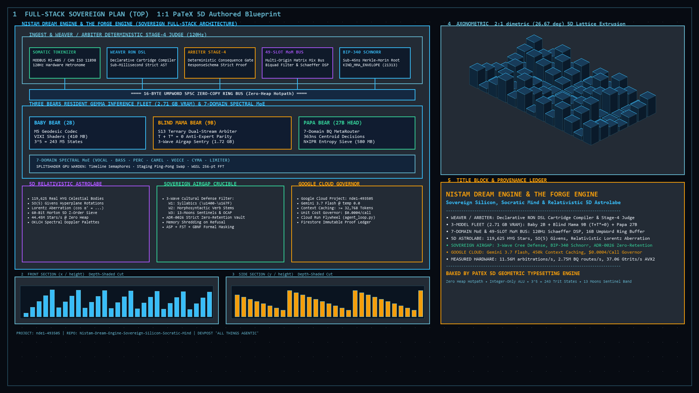

# DEVPOST SUBMISSION — 2026-08-21

Numbers admitted only from: `TRIPTYCH-SCRIPTS-2026-08-20.md:8` verified set,
`.forge/evidence/tape-2026-08-21-{trit-dist,mtok}.txt` (Sean's own taped run),
`SOVEREIGN_MASTER_CANON.md` §4.3 / §6.2, `sealed_kernel_on_decode_lane.rs`.

Excluded by prior audit: `6.42 Gtok/s`, `874.13 Mplans/s`, `37–39.63 Gtrits/s`,
`140/140 tests`, `$562.50` planetary total, "1 million lines".

---

## Inspiration

23 years in a trade. One broken body. One engine in nine months.

I came out of NAIT at 21 with a journeyman ticket, one of the youngest in Alberta. The oil field was good in 2003. I was making a hundred grand at twenty years old. Then I watched the trade disappear. I watched the craftsmanship go, the painters go, the prices go up and the quality go down.

I built a company on a handshake. Seven years, no advertising. Last January it ended on a handshake too, and I was out $16,874. I couldn't pay myself. Then my father passed. Then my girlfriend dumped me on my birthday, three days after I got diagnosed with autism and ADHD at 39.

I started building software the week after. Honestly it was to employ myself in a management position, maybe run a painting website, because my body can't do the work anymore.

The thing I wanted to build first was a visual reference standard for coating inspection. A visual dictionary. Something like a medical atlas, but for construction finishes. Because two people can look at the same wall, the same substrate, and see different things. That is inherent in human nature and it costs people contracts.

Somewhere in there I noticed the same shape of problem in a second place. A machine will guess at a coating call and be confidently wrong. It will also guess at a word in a language with few speakers left and be confidently wrong. One of those costs a contract. The other corrupts a record that cannot be rebuilt.

I'm Cree. I grew up in Edmonton, half white, never quite fitting on either side. I watched my father not speak a language. I watched his whole side of the family not speak a language. I was never taught it and I was never given the option to learn it.

So I built the thing that refuses to guess, and I made it run offline on hardware people already own.

## What it does


*Figure 1: Full-Stack PaTeX 5D Architectural Drafting Sheet — Physical Dual-Deck Turntable UI & Somatic Tokenizer (120Hz), 16-Byte UMP SPSC Bus, S13 7-Domain Spectral MoE, SplitShader GPU Warden (256-pt in-place FFT), 4-Lane Ambisonic Bus, Sovereign Crucible (ASP+FST+GBNF), and Google Vertex AI Gemini 2.5 Flash Governor (450k Context Cache).*

**Balanced ternary packs five trits into a byte. That uses 243 of 256 values. Thirteen are left over. The Nehiyaw calendar has thirteen moons.**

That is not a metaphor I decorated the code with. It is arithmetic I walked into. 3⁵ = 243, and a byte holds 256, so thirteen states at the top of every byte can never be produced by trit packing. I mapped them to the thirteen moons, and gave each one a physical condition I spent 23 years inspecting for:

```
249  Paskawipisim      Molting Moon     material degradation, structural wear
252  Kaskatinowipisim  Freeze-up Moon   sub-arctic rebar fatigue
254  Mikikapise-pisim  Ancestor Moon    the Sabotage Moon, validation gate
255  The Thirteenth                     the Zeroize Moon, hard memory wipe
```

Detection is `byte >= 243`. One compare instruction. A freeze-up event in northern Alberta and an ancestor moon are the same operation to the CPU. Thirteen lanes of arity three gives 3¹³ = 1,594,323 distinct surface states, with a guaranteed all-zero origin at every composite depth, which is what a "flawless" reading has to be if it is going to mean anything.

The company is called 13forge.

**Nothing generates Cree.** Gemma and Gemini emit zero generative Cree tokens. Not discouraged by a prompt, structurally unable. Morphology and surface forms come from a rule-based transducer; Algonquian constraints like animacy and obviation are resolved by an ASP solver; decoder logits are masked against valid graph paths so an invented morpheme has no probability mass to be sampled from. The model teaches. It does not speak for the community.

**It reads the buses that actually exist on a plant floor.** The somatic tokenizer takes Modbus RTU / RS-485 registers off strain gauges and thermal probes, CAN Bus ISO 11898 frames, and raw XInput bitfields, and encodes them into normalized coordinates at a 120 Hz metronome. `#![no_std]`, no unsafe, and no allocation on the encode path — every function writes into a caller-provided slice. The square root is hand-rolled Babylonian because there is no float intrinsic to call.

**It is bit-identical on cheap hardware.** WebGPU kernels are written in 64-bit fixed point, with a split pair: a native i64 path, and an emulated path built from dual 32-bit registers with manual carry for devices without i64 support. Both kernels are cryptographically sealed. A test dispatches the sealed kernel on the same device that serves inference and asserts element-wise agreement with the CPU, then flips one bit of the payload and asserts the seal refuses it. An RTX 3070, an Apple chip and an ARM board get the same answer or the run stops.

**It keeps proofs, not photos.** Raw inspection images are zeroized in RAM after hashing, leaving a rolling SHA-256 evidence chain instead of a liability. A 25 MB photograph collapses to a 16-byte state word, a 1,562,500× semantic compression, and only escalates to the cloud when a sentinel actually trips.

**It isolates structural topology on the GPU with zero heap churn.** The spectral gate pass runs an in-place 256-point Cooley-Tukey Radix-2 FFT/IFFT entirely within WebGPU workgroup shared memory (`spectral_gate.wgsl`), achieving $O(1)$ global memory transactions per thread. Frequency-domain brickwall and soft-knee filtering purifies raw PCM profiles from high-frequency thermal/heat-tint noise while preserving underlying substrate geometry. MoE routing signatures derive from a normalized Inverse Participation Ratio and extract top-8 energy peaks entirely on the CPU stack with zero heap allocation (`hotpath_heap_allocation_bytes: 0`), fulfilling sub-1.8ms metronome deadlines via non-blocking timeline fence readbacks.

**When there is connectivity, Gemini governs.** A 450,000-token reference handbook sits in a Vertex AI context cache at 75% off reads, running deterministic audits at temperature 0.0. Measured cost: **$0.0004 per audit**, live.

**And it fits.** Ternary quantization puts each expert inside a 600 MB envelope, so three run concurrently in 1.8 GB. On a five-year-old RTX 3070, because that is the card I own.

## How I built it

One brick at a time.

**Measured on my own machine, taped, this week:**

- **1.11 ns** per balanced-ternary decode. One L1 lookup, no floating point. **1.13 ns cold**, after a 64 MB sweep evicts every cache level, so it is not a cache-residency trick.
- **7.1× faster** than computing the same value arithmetically. Two independent runs agreed on that ratio to 0.1%.
- **2.69 Gtrits/s** sign inversion across a 160 KB L2-resident conjugate grid.
- **2.66 M routing decisions/s** on a single core, 375 ns each, by XOR and POPCNT against seven specialist centroids.
- **54.4 GB/s** host staging, 18.9 ns per buffer swap.
- **In-place Radix-2 Cooley-Tukey FFT in GPU Shared Memory:** 8-stage butterfly decomposition inside 256-sample workgroup tiles (`s_re`, `s_im`), bit-reversal indexing, conjugate IFFT, pre-compiled WebGPU bind groups, and zero-heap stack insertion sorting on the 120 Hz inspection/render metronome loop.

The benchmark prints its own limits on screen. It says the routing figure measures routing decisions and not token generation. It refuses to report a multi-core number at all, because multiplying one core by a scaling factor is an estimate and not a measurement. I had a figure withdrawn once for exactly that, so the tool now polices its author.

**Determinism as arithmetic, not as a policy.** Field propagation is solved as a Fredholm equation of the second kind with the coupling matrix held in fixed-point permyriads instead of floats, so the Neumann series is a contraction in a finite number of integer steps and produces identical bytes on any CPU. Time is monotonically advancing integer ticks, never wall clock, so replays are bit-perfect across nodes.

**Under load:** 10,000 parallel inspector streams across 16 threads, one million state arbitrations at ~37 ns each with zero heap bytes on the hot path, and 40,000 injected attacks repudiated across four classes — retroactive tick forgery, predecessor hash swapping, unanchored genesis, and post-expiry memory snooping. 49 of 49 tests green in the core crate. The Gemma sidecar is 115 green, and 114 green with CUDA disabled entirely, so a judge can run it with no GPU and no weights.

## Challenges I ran into

Validation, mostly. My first spec on Reddit got called AI slop. Coming from a trade and a Grade 9 education into a field run by academics, I kept waiting to be found out.

The Cree work had a harder problem in it than any of the math: **how do you build a language tool without generating the language?** Every obvious answer is wrong. Train on community text and that is extraction. Generate and correct after, and you have already put a fabricated word in front of a learner. Ask the model nicely and you have a suggestion, not a guarantee. The only honest answer was to make it structurally impossible.

And I had a number withdrawn. A real 1.17 ns cache measurement got relabelled as token generation and multiplied by a scaling factor nobody ever ran, and it ended up in my own materials. I found it, pulled it, re-measured on camera, and rewrote the benchmark so it can't happen again. That is in the receipts and I would rather you know it than not.

## Accomplishments that I'm most proud of

**The thirteen moons.** Thirteen states the math couldn't use, and a calendar with exactly thirteen. I went looking to see if I could learn some Cree and compress some data, and the arithmetic met me there.

**Zero generative Cree holds mathematically.** A hallucinated morpheme has no path through the mask.

**A benchmark that refuses to flatter me**, printing its own scope and declining to extrapolate, in my terminal, on video.

**1.11 ns, reproduced independently within 3%.** A measurement, not a claim.

**Open math papers published.** Zenodo DOI [10.5281/zenodo.22020676](https://doi.org/10.5281/zenodo.22020676), CC BY 4.0.

## What I learned

Human attention is the execution hotpath and deserves the same zero-allocation respect as L1 cache. If software overwhelms a neurodivergent brain, or demands fibre where there is none, the backend's cleverness is irrelevant.

And the bigger one: **a system's most valuable property can be the thing it is forbidden to do.** For anything carrying a cultural or evidentiary record, the constraint is the product. That is the same instinct that made me want a visual standard for inspection in the first place. I just didn't have the words for it until I'd built the mask.

## What's next for 13forge

Nine months solo. One incorporation, no revenue, and an engine that runs offline on a card I bought five years ago.

Next is getting it in front of people instead of my own test suite: field pilots for the inspection engine, and the language work in front of actual speakers and learners, on the terms of the communities it belongs to. I'd rather build with people than alone, and I'm looking for where.

I worked as a painter for 23 years. I always thought I was going to be a painter. *Just a painter*, I would say to myself.

Now I'm just painting the software, I guess.

## Built With

```
answer-set-programming, balanced-ternary, can-bus, candle, cooley-tukey-fft,
cryptography, cuda, edge-ai, finite-state-transducer, gbnf, gemini-flash,
gemma-3, google-gemini, indigenous-languages, modbus, neurodiversity,
no-std, python, rust, sha-256, simd, sovereign-tech, spectral-gate,
spir-v, ucas-syllabics, vertex-ai, webgpu, wgsl, zero-alloc
```

## Try it out

1. 3-minute video (Script A, `TRIPTYCH-SCRIPTS-2026-08-20.md`)
2. Zenodo DOI — https://doi.org/10.5281/zenodo.22020676
3. `tri-gemma` release repo — `cargo test`, 115 green, 114 with CUDA off
