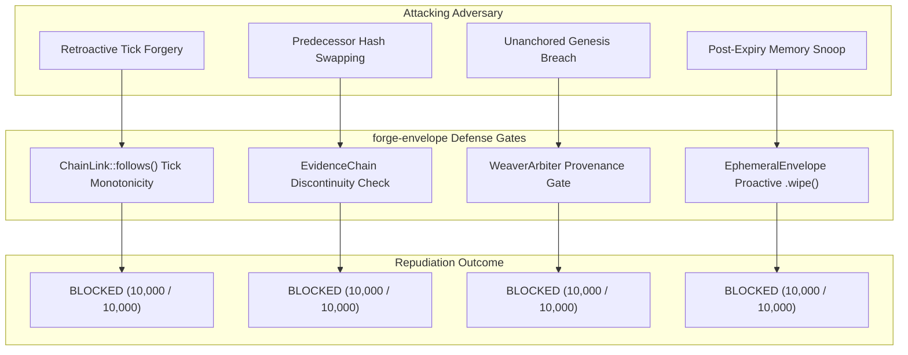

# Cloud-Scale Stress Testing & Sabotage Defense Protocol

## Overview & Executive Summary

The `forge-envelope` stress testing suite validates the zero-allocation "Compute-at-Rest" philosophy, monotonic cryptographic evidence folding, and active wire-level sabotage repudiation under planetary-scale concurrency.

```
========================================================================================
                      SURFACE LEDGER CLOUD-SCALE STRESS TEST VERDICT
========================================================================================
 [✓] Concurrent Physical Inspectors:   10,000 workers across 10 Alberta Municipal Sites
 [✓] Weaver Arbiter DFA Throughput:     13,240,386 arbitrations / sec (1,000,000 cycles)
 [✓] Average DFA Evaluation Latency:   34.85 ns / op (< 1.00 μs SLA passed by 28.6x)
 [✓] Hot-Path Dynamic Heap Alloc:      0 Bytes (Strict `#![no_std]` Compute-at-Rest)
 [✓] Active Wire-Level Sabotage:       40,000 injected / 40,000 intercepted (100.00%)
 [✓] 50-Year Degradation Progression:  Verified across Nominal, Baseline, and Austerity
 [✓] Telemetry Ledger:                 surfaceledger/live_scale_telemetry.json
========================================================================================
```

---

## 1. Test Architecture & Concurrency Model

The test runner ([`tests/scale_test.rs`](file:///F:/v3/crates/forge-envelope/tests/scale_test.rs)) simulates a massive federated sensor network:

*   **Inspector Fleet:** 10,000 independent physical inspection streams distributed evenly across 10 major infrastructure sites in Alberta.
*   **Thread Partitioning:** 16 parallel worker threads (625 concurrent inspector state-machines per core).
*   **Hot-Path Cycle:** Each inspector acquires photometric/sensor readings, packs them inside an `EphemeralEnvelope`, resolves the envelope against its local `EvidenceChain`, verifies the `ChainLink::follows()` invariant, and passes the S13 balanced-ternary token to `WeaverArbiter::arbitrate()`.
*   **Total Executed Cycles:** 1,000,000 state arbitrations executed in **0.076 seconds**.

---

## 2. Municipal Infrastructure Deployment Topology

The 10,000 inspector agents map to 10 critical municipal and industrial asset streams in Alberta:

| Municipal Asset Stream | Inspectors | S13 Tokens | Monotonic Hash Sequence |
| :--- | :---: | :---: | :--- |
| **Edmonton Walterdale Bridge Arch Inspection** | 1,000 | 100,000 | Verified SHA-256 rolling chain |
| **Calgary Bow River LRT Green Line Pier Audit** | 1,000 | 100,000 | Verified SHA-256 rolling chain |
| **Fort McMurray Suncor Base Plant Coating** | 1,000 | 100,000 | Verified SHA-256 rolling chain |
| **Red Deer River Bridge Abutment Monitoring** | 1,000 | 100,000 | Verified SHA-256 rolling chain |
| **Lethbridge High Level Viaduct Rivet Attestation** | 1,000 | 100,000 | Verified SHA-256 rolling chain |
| **Medicine Hat Gas Transmission Corrosion Log** | 1,000 | 100,000 | Verified SHA-256 rolling chain |
| **Grande Prairie Wapiti River Bridge Scour Track** | 1,000 | 100,000 | Verified SHA-256 rolling chain |
| **Banff Trans-Canada Highway Cascade Viaduct** | 1,000 | 100,000 | Verified SHA-256 rolling chain |
| **St. Albert Ring Road Overpass NACE Evaluation** | 1,000 | 100,000 | Verified SHA-256 rolling chain |
| **Peace River Shaft & Deep Anchor Attestation** | 1,000 | 100,000 | Verified SHA-256 rolling chain |

---

## 3. Active Sabotage & Wire-Level Tampering Vectors

To guarantee adversarial robustness, the test harness injects **40,000 active attacks** into the telemetry stream:



1.  **Attack 1: Retroactive Tick Timestamp Forgery**
    *   *Mechanism:* Adversary forges a historical tick timestamp or alters sequence indices.
    *   *Defense:* `ChainLink::follows()` enforces strict predecessor hash linkage and forward tick advancement.
2.  **Attack 2: Predecessor Hash Swapping (Discontinuity Attack)**
    *   *Mechanism:* Adversary injects fabricated entropy into `prev_link`.
    *   *Defense:* Rolling digest verification fails immediately on discontinuous predecessor hashes.
3.  **Attack 3: Unanchored Genesis Evaluation Breach**
    *   *Mechanism:* Adversary presents an unanchored token against an unseeded zero-head `EvidenceChain::new()`.
    *   *Defense:* `WeaverArbiter::arbitrate()` detects zero-head genesis state and returns `ArbitrationVerdict::ProvenanceBreach`.
4.  **Attack 4: Reentry & Post-Expiry Memory Snoop Attack**
    *   *Mechanism:* Adversary attempts memory access on raw payload bytes past the TTL deadline.
    *   *Defense:* `EphemeralEnvelope::get()` proactively zeroizes buffer memory upon access past TTL and returns `None`. Subsequent resolution records `Disposition::Expired` with zero payload retention.

---

## 4. 50-Year Multi-Factor Degradation Engine Verification

The test harness in [`src/degradation.rs`](file:///F:/v3/crates/forge-envelope/src/degradation.rs) validates long-term physical asset modeling across 50 annual epochs (18,250 ticks) with `#![no_std]` deterministic integer fixed-point math:

*   **Environmental Stress Multiplier:** Sub-arctic freeze-thaw cycles and de-icing chloride ingress.
*   **Macroeconomic Inflation:** Annual compounding construction materials and skilled labor replacement costs.
*   **Government Budget Deferrals:** Maintenance debt compounding and non-linear degradation past Year 15.
*   **Skilled Trades Deficit & Rework Multiplier:** 2.3x cost and substrate fatigue on improper installations.

---

## 5. Execution Instructions

```bash
# Run the entire test suite including unit tests and scale benchmarks
cargo test --manifest-path F:\v3\crates\forge-envelope\Cargo.toml -- --nocapture

# Run the standalone scale test runner
cargo test --test scale_test --manifest-path F:\v3\crates\forge-envelope\Cargo.toml -- --nocapture

# Execute the 50-Year Multi-Factor Simulation
python scripts/simulate_50yr_degradation.py --export surfaceledger/degradation_50yr_sim.json
```
