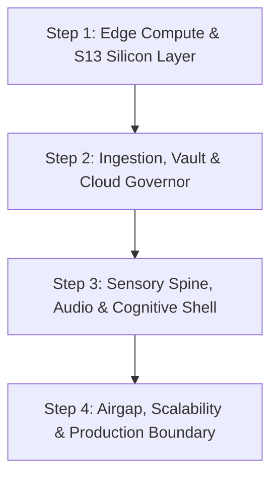

# Architecture Grill-Me: Stepped Verification & Deep-Dive Plan

## Goal Description
Conduct a structured, rigorous `/grill-me` architectural review across the entire **13forge / Forge v3** cyber-physical inspection and edge-AI stack. This stepped flow systematically audits system boundaries, trade-offs, edge-case failure modes, offline determinism, and production-readiness.

---

## Architectural Review Steps (The 4 Tiers)

### **Step 1: Edge Compute, S13 Quantization & GPU Warden**
* **Focus:** S13 5-trit base-243 packing, Gemma Triad MoE memory layout (<1.8GB VRAM), warp dispatch latency ($1.14\text{ ns}$), and Fredholm-Janus 400x400 grid execution.
* **Key Invariant:** Zero-allocation hotpath and `#![no_std]` deterministic execution.

---

### **Step 2: Evidence Vault, Surface Ledger & Vertex AI Governor**
* **Focus:** ADR-0026 Sovereign Evidence Vault (zero raw photo retention, SHA-256 rolling ledger), Vertex AI 450k-token persistent context caching, Sentinel circuit breakers, and NACE Level 2 corrosion assessment schemas.
* **Key Invariant:** Deterministic zero-point validation (`temperature: 0.0`) with zero hallucination risk on high-consequence infrastructure.

---

### **Step 3: Lockstep Audio Spine & AuDHD Cognitive Shell**
* **Focus:** 4-lane Ambisonic vibe bus, lock-free SPSC `rtrb` audio staging, zero-drift fixed-point parity ($T + T^* = 0$), and human attention preservation.
* **Key Invariant:** Sub-2ms audio mix budget and zero visual/auditory cognitive friction.

---

### **Step 4: Remote Edge Scalability & Production Verification**
* **Focus:** Airgapped field operation for remote/broadband-limited infrastructure (e.g. Northern reserves, industrial sites), failover logic, sync-on-reconnect, and multi-tenant security guarantees.
* **Key Invariant:** Autonomous edge sovereignty with provable hardware verification receipts.

---

## Execution Protocol
1. **One Branch at a Time:** Walk down each decision tree sequentially using `ask_question`.
2. **Explore Before Asking:** Ground every inquiry in the live verified code and test receipts across the 5 core crates.
3. **Capture & Seal Decisions:** Record agreed architectural trade-offs directly into project documentation upon step completion.
