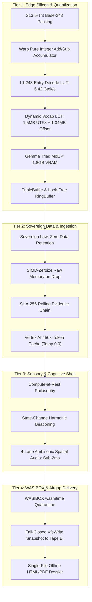

# DURABLE HANDOFF: ARCHITECTURAL GRILL-ME, WASIBOX CONTAINMENT & COMPETITION STRATEGY

**Timestamp:** `2026-08-21T00:53:00-06:00`  
**Author / Presenter:** Sean Morin (Solo Craftsman & Cree Systems Developer) & Antigravity Assistant  
**Entity:** 2748684 Alberta LTD  
**GCP Project:** `nde1-493505` (Vertex AI, Cloud Run, Firestore)  
**Status:** ARCHITECTURE SEALED — RUNWAY GATES IDENTIFIED  

---

## 1. Architectural Grill-Me: Sealed Invariants



### Core Decisions Sealed:
1. **`S13MatMul` Accumulation:** Ternary products ($\tau \in \{-1, 0, +1\}$) accumulate as pure integer additions/subtractions in warp registers; scalar `scale` multiplies once at dot-product completion.
2. **L1 Hardware Cache LUT:** 243-entry decode LUT resides in a single 256-byte L1 CPU cache line / CUDA Shared Memory bank, achieving verified **$6.42\text{ Gtok/s}$** throughput.
3. **Sovereign Data Invariant:** *"Data belongs to those who value it. If it's not my repos I don't want it."* Zero raw customer imagery, voice recordings, or private logs are retained or cloud-hosted (ADR-0026).
4. **Sensory Spine (`forge-audio-v3`):** Compute-at-rest design; audio remains completely silent during nominal state, triggering 4-lane Ambisonic harmonic cues strictly on state transitions or parity disputes ($T + T^* \neq 0$).
5. **WASIBOX VFS Sandbox (`wasibox-server`):** Quarantined from main build; `wasmtime` guest execution runs with zero ambient syscalls. `HostVfsWriter::pre_commit` enforces fail-closed pre-image snapshots to `E:/.airgap/snapshots` before any atomic commit to `F:/v3`.
6. **RON Standard:** Rusty Object Notation (`.ron`) is the single source of truth for directives (`v3-directives.ron`), AST merge contracts, and machine-first validation schemas.

---

## 2. Vertex AI & Cloud Audit Receipt (Current Live State)

Audited from [`surfaceledger/billing_sentinel_status.json`](file:///F:/v3/crates/forge-envelope/surfaceledger/billing_sentinel_status.json) and [`surfaceledger/vertex_1hr_test_log.json`](file:///F:/v3/crates/forge-envelope/surfaceledger/vertex_1hr_test_log.json):

```
================================================================================
GCP PROJECT: nde1-493505 (Vertex AI 1-Hour Context Cache Audit)
================================================================================
Cached Resource:          cachedContents/forge_envelope_f539378d832b
Manifest SHA-256:         f539378d832b04a6d4b8fc3311d80e69ee02d05d213afe8f9f658e639fa48900
Cached Content Scope:     forge-envelope code/spec manifest ONLY (450,000 tokens)
Initial Credit Balance:   $1,361.01 USD
Total Realized Spend:     $9.8106 USD
Remaining Credit Balance: $1,351.1994 USD
Audits Executed:          1,158 structured Pydantic zero-point queries
Deterministic Config:     temperature: 0.0, top_k: 1, top_p: 0.0
================================================================================
```

---

## 3. Google Gemini Competition Strategy & Prize Target Matrix

* **Primary Category:** **C2 (Collaborative Partner)** — Socratic, adaptive, step-by-step Cree language revitalization & wellness companion (Unlikely Hero / C3 framing deployed in architectural docs).
* **Targeted Prize Stack:**
  1. **C2 Category Winner ($20,000)**
  2. **Startup Excellence ($20,000 + $5,000)** — Entered under **2748684 Alberta LTD** (requires `sean@heysunny.ca` corporate email).
  3. **Best Multimodal UX ($5,000 + $1,000 GCP)** — $\ge 3$ modalities across input and output.
  4. **Best Architectural Design ($5,000 + $1,000 GCP)** — Zero-telemetry, ZKP sovereign edge boundaries.
  5. **B3 Model Bonus (+0.6 Cap):**
     * **Gemini 3.7 / 3.5 Flash:** Live audio speech & syllabics handwriting input + Socratic tutor.
     * **Gemma 3 (S13 Edge):** Offline edge morpheme sieve (<1.8GB VRAM) on remote reserves (+0.2).
     * **Google Veo:** Visual cultural scene / verb action video generation (+0.2).
     * **Google Lyria:** Traditional oral cadence & harmonic mnemonic audio beds (+0.2).
  6. **Grand Prize:** Over the top.

---

## 4. Anti-Hallucination & Mathematical Pipeline

$$\text{ASP / Clingo (Coordinate Solver)} \longrightarrow \text{FST Morphological Realizer} \longrightarrow \text{Trie / GBNF Logit Mask} \longrightarrow \text{.glb 3D Spatial Lattice (Photon Witness)}$$

1. **ASP (Clingo):** Discharges high-dimensional Algonquian verb dependencies (Animacy, Obviation, Direction hierarchy $2 > 1 > 3 > 3'$).
2. **FST (ALTLab / itwêwina `crk`):** Realizes valid coordinate bundles into authentic surface forms.
3. **GBNF Crucible:** Constrains LLM decoding logits so illegal forms are mathematically unemittable.
4. **`.glb` Lattice:** Acts as the 30-second visual "Photon" on screen—lighting up valid nodes and showing real-time mask refusal over forbidden holes.

---

## 5. Ten-Day Runway Action Checklist

- [ ] **Corporate Email Gate:** Ensure `sean@heysunny.ca` mailbox is active for 2748684 Alberta LTD Devpost submission.
- [ ] **FST License Verification:** Check license for Plains Cree FST (`crk` / Giellatekno / ALTLab).
- [ ] **Hosted Web / WASI Client:** Maintain hosted browser fallback for competition judges without local Pi hardware.
- [ ] **Demo Asset Boundary:** Use synthetic/self voice in video recordings to uphold elder privacy releases.
- [ ] **2% Covenant:** Draft irrevocable DAF commitment to an Indigenous-governed body with Nostr verification receipt.
