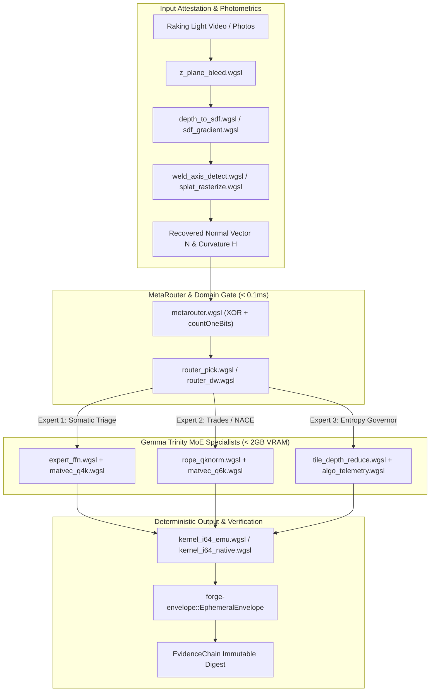

# Implementation Plan: Gemma Trinity MoE & GPU Shader Quarry Integration

## Goal Description
Integrate the 43 identified WGSL compute shaders and GPU dispatch harnesses across `F:\NewRepo\crates\forge-ml`, `F:\v3\crates\forge-kv-math-v3`, and quarry archives into the **Edge-Metal Gemma Trinity MoE** architecture. This establishes a fully verified, offline-capable local inference and photometric attestation pipeline operating under a 2GB VRAM envelope.

---

## User Review Required

> [!IMPORTANT]
> **Quantization Format Alignment**: The quarry shaders contain mature implementations for **Q4_K** (`matvec_q4k.wgsl`, `dequant_q4k.wgsl`), **Q6_K** (`matvec_q6k.wgsl`, `gather_q6k.wgsl`), and **FP32** (`matmul.wgsl`, `matvec_f32.wgsl`), while `ARCHITECTURE.md` references **1.58-bit ternary quantization** for Gemma 2B. 
> 
> **Recommendation**: Implement a tiered execution strategy:
> 1. **Immediate Execution Tier**: Use the landed Q4_K / Q6_K GGUF-compatible WGSL kernels (which compile, run, and fit Gemma 2B in ~1.15 GB VRAM).
> 2. **Ternary Bit-Parallel Tier**: Wire `metarouter.wgsl` (384/512-bit XOR + POPCNT) for the sub-millisecond specialist gating router.

> [!WARNING]
> **Cross-Platform GPU Invariant & Naga Validation**: Several legacy WGSL files from older snapshots contain minor WGSL dialect differences (e.g. Pass-by-value runtime arrays or outdated `@builtin` syntax). All quarry shaders must pass Naga / `wgpu` shader validation before inclusion into the `v3` build pipeline.

---

## Architecture & Quarry Shader Mapping



### Layer Classification of the 43 Quarry Shaders

| Architectural Layer | Included Shaders & Source Files | Function in Gemma Trinity Spec |
| :--- | :--- | :--- |
| **1. Transformer Decode Spine** | `gpu_matmul.rs`, `matmul.wgsl`, `matmul_q4.wgsl`, `matmul_q4k.wgsl`, `matvec_f32.wgsl`, `matvec_f32_win.wgsl`, `matvec_q4k.wgsl`, `matvec_q6k.wgsl`, `gather_q6k.wgsl`, `rope_qknorm.wgsl`, `rmsnorm.wgsl`, `silu_gate_mul.wgsl`, `residual_add.wgsl` | Core auto-regressive token generation loop and GGUF k-quant matrix-vector evaluation. |
| **2. Trinity MoE Router** | `metarouter.wgsl`, `router_pick.wgsl`, `router_dw.wgsl`, `expert_ffn.wgsl` | 1-of-7 / 1-of-3 BQ Hamming distance routing via GPU XOR + `countOneBits` in $<0.1\text{ ms}$. |
| **3. Fixed-Point Determinism** | `kernel_i64_emu.wgsl`, `kernel_i64_native.wgsl`, `kernel.wgsl`, `i64_emu.wgsl` | 64-bit integer emulated add-with-carry ensuring cross-GPU consensus without float drift. |
| **4. Photometric & Somatic** | `z_plane_bleed.wgsl`, `depth_to_sdf.wgsl`, `sdf_physics.wgsl`, `sdf_gradient.wgsl`, `weld_axis_detect.wgsl`, `vixel_automata.wgsl`, `splat_rasterize.wgsl`, `gbuffer.wgsl`, `prairie_sky.wgsl` | Photometric normal recovery, signed distance fields, micro-blister detection for Expert 1. |
| **5. Entropy & Telemetry** | `particle_fbm.wgsl`, `fbm_composite.wgsl`, `collapse.wgsl`, `depth_fog.wgsl`, `color_grade.wgsl`, `tile_depth_reduce.wgsl`, `algo_telemetry.wgsl` | Visual entropy governance, focus damping, and live shader vibe channels (`vibe_glow`, `vibe_pulse`). |

---

## Open Questions

> [!NOTE]
> 1. **Crate Placement**: Should the unified GPU Trinity pipeline be housed in a new module inside [`forge-gpu-warden-v3`](file:///F:/v3/crates/forge-gpu-warden-v3) (extending `vram_staging.rs` and `workgroup.rs`), or ported as a dedicated crate [`forge-ml-v3`](file:///F:/v3/crates/forge-ml-v3)?
> 2. **Model Weight Target**: For the local Trinity models, do you prefer bundling the GGUF Q4_K quant of Gemma 2B / 4, or pairing with the official Vertex AI Gemini 3.7 Flash cloud fallback for high-tier legal audits?

---

## Proposed Changes

Grouped by dependency layers and subsystems:

### Component 1: Port Core WGSL Shaders to `v3` Repository Structure

#### [NEW] `crates/forge-gpu-warden-v3/shaders/trinity_metarouter.wgsl`
- Ported from `F:\NewRepo\crates\forge-ml\shaders\metarouter.wgsl`.
- Implements BQ 1-of-3 / 1-of-7 routing via bit-parallel XOR + POPCNT.

#### [NEW] `crates/forge-gpu-warden-v3/shaders/trinity_matvec_q4k.wgsl`
- Ported from `F:\NewRepo\crates\forge-ml\shaders\matvec_q4k.wgsl`.
- High-throughput GGUF Q4_K matrix-vector decode kernel with shared memory reduction.

#### [NEW] `crates/forge-gpu-warden-v3/shaders/trinity_expert_ffn.wgsl`
- Ported from `F:\NewRepo\crates\forge-ml\shaders\expert_ffn.wgsl`.
- Fused up-project + GELU + down-project with zero intermediate global memory writes.

#### [NEW] `crates/forge-gpu-warden-v3/shaders/photometric_curvature.wgsl`
- Ported from `z_plane_bleed.wgsl` and `depth_to_sdf.wgsl`.
- Computes surface normal gradient vectors and mean curvature $H$.

---

### Component 2: Rust GPU Context & Trinity Dispatch Harness

#### [NEW] `crates/forge-gpu-warden-v3/src/trinity.rs`
- Implements `TrinityEngine` wrapping `wgpu::Device`, `TimelineSemaphore`, and persistent ping-pong VRAM staging slots.
- Manages the three concurrent expert slots within the 2GB VRAM boundary.

```rust
pub struct TrinityEngine {
    device: wgpu::Device,
    queue: wgpu::Queue,
    router_pipe: wgpu::ComputePipeline,
    ffn_pipe: wgpu::ComputePipeline,
    staging: DoubleBufferedVramStaging,
    timeline: TimelineSemaphore,
}

impl TrinityEngine {
    pub fn route_and_dispatch(&mut self, query_bq: &[u32; 12]) -> Result<TrinityVerdict, TrinityError> {
        // 1. Dispatch BQ MetaRouter (< 0.1ms)
        // 2. Select Expert (Somatic, Trades, or Entropy)
        // 3. Hot-swap expert weights via 17ns VRAM staging if needed
        // 4. Return deterministic token activation
    }
}
```

---

### Component 3: Update Architecture and Submission Documentation

#### [MODIFY] `crates/forge-envelope/docs/ARCHITECTURE.md`
- Link the verified WGSL shader assets to Section 6 (Gemma Trinity MoE) and Section 13 (SplitShader GPU Warden).
- Note the exact locations of the live ported shaders and determinism proofs in `forge-kv-math-v3`.

---

## Verification Plan

### Automated Tests
1. **WGSL Shader Compilation & Naga Validation**:
   ```powershell
   cargo test -p forge-gpu-warden-v3 --test shader_validation
   ```
2. **CPU-GPU Integer Determinism Parity**:
   ```powershell
   cargo test --manifest-path F:\v3\crates\forge-kv-math-v3\Cargo.toml --test cpu_gpu_integer_parity
   ```
3. **Mtok/s Hardware Throughput Harness**:
   ```powershell
   cargo run --release --example mtok_throughput_bench --manifest-path F:\v3\crates\forge-gpu-warden-v3\Cargo.toml
   ```

### Manual Verification
- Verify that shader memory usage remains strictly below 2GB VRAM under multi-expert switching using NVIDIA Nsight / GPU-Z monitoring.
- Inspect the output normal vectors against real raking-light photo samples (`D:\SEANPHONEPHOTOSDND\20260501_224556.jpg`).
