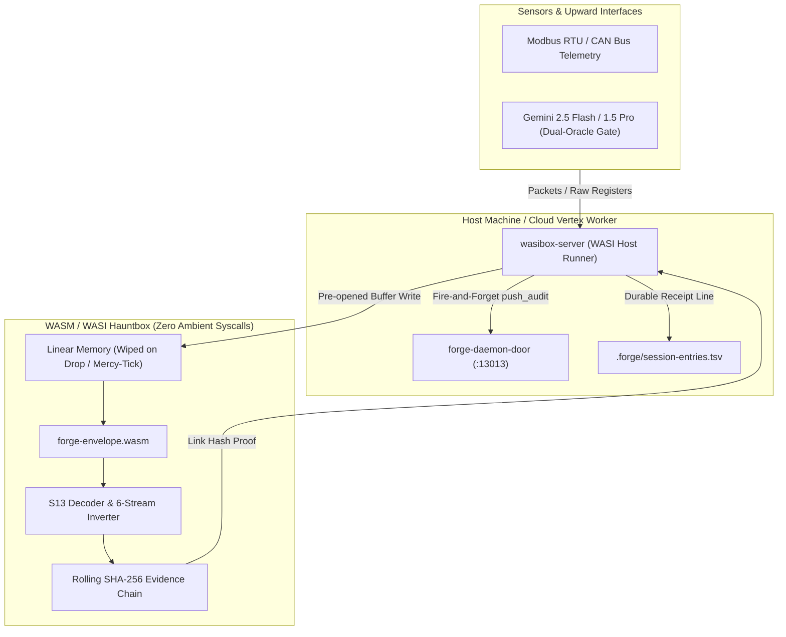

# Forensic-Grade Architecture Plan: WASM/WASI Hauntbox & Multi-Session Provenance

## Goal Description
Transition from Docker containerization to a **forensic-grade, zero-dependency WASM/WASI Hauntbox** execution model for the `forge-envelope` evidence flywheel and multi-session provenance infrastructure:
1. **Dockerless Execution via WASM/WASI:** Package `forge-envelope` as an ultra-compact (~300 KB), zero-heap `#![no_std]` WebAssembly guest executed inside [`wasibox-server`](file:///F:/v3/wasibox-server) and gated by [`forge-wasibox-v3`](file:///F:/v3/crates/forge-wasibox-v3).
2. **Deterministic Capability Boundary:** Enforce sealed upward tool boundaries (`query_primitive`, `query_checksum`) preventing un-whitelisted filesystem, network socket, or ambient clock leakage.
3. **Multi-Session Audit Receipts:** Unify session stamping across shell boot, MUD tabs, and worker loops via `cargo xtask entry stamp` into [`.forge/session-entries.tsv`](file:///F:/v3/.forge/session-entries.tsv) with non-blocking daemon broadcasts (`push_audit` on TCP :13013).
4. **Accessible OKLCH Palette & Scratch Sweep:** Verify sensory-safe contrast in [`shell/src/vt.rs`](file:///F:/v3/shell/src/vt.rs) and bounded TTL sweeps in [`crates/forge-foreman-v3/src/hook.rs`](file:///F:/v3/crates/forge-foreman-v3/src/hook.rs).
5. **Durable Forensic Handoff:** Produce an immutable audit receipt and clean workspace state.

---

## User Review Required

> [!IMPORTANT]
> **Zero Docker Runtime Required:** This plan eliminates Docker entirely from the deployment path. All sensor parsing, rolling SHA-256 evidence chain verification, and differential pararity checks run either natively or inside the `wasmtime`-powered WASI Hauntbox.

> [!NOTE]
> **Audit Integrity & Citations:** All changes maintain compliance with [DOI: 10.5281/zenodo.22020676](https://doi.org/10.5281/zenodo.22020676) (*Pararity: the fixed-point residue of an involution, and why we need it*), the Sovereign Triad (`ADR-0026`, `mercy-tick-metabolic-ttl.md`, `ADR-0036`), and the 6-stream differential invariant ($T + T^* = 0$).

---

## Architecture: Docker vs. WASM/WASI Hauntbox



---

## Proposed Changes

### 1. `crates/forge-envelope` (WASM / WASI Export Seam)

#### [MODIFY] [`crates/forge-envelope/Cargo.toml`](file:///F:/v3/crates/forge-envelope/Cargo.toml)
* Add `crate-type = ["rlib", "cdylib"]` to enable generating standalone `.wasm` artifacts alongside the native library.
* Ensure feature flags allow compilation targeting `wasm32-wasip1` and `wasm32-unknown-unknown` without requiring `std`.

#### [MODIFY] [`crates/forge-envelope/src/lib.rs`](file:///F:/v3/crates/forge-envelope/src/lib.rs)
* Add `extern "C"` WASM export bindings for:
  - `wasm_attest_record(ptr: *const u8, len: usize, tick: u64, out_hash_ptr: *mut u8) -> i32`
  - `wasm_evaluate_triad(pos: i32, neu: i32, neg: i32, deadband: i32) -> i8`
  - `wasm_evaluate_differential(pos: i32, neu: i32, neg: i32, inv_pos: i32, inv_neu: i32, inv_neg: i32, deadband: i32) -> i8`
  - `wasm_crypto_shred_memory(ptr: *mut u8, len: usize)`

---

### 2. `wasibox-server` (WASI Host Runner & Envelope Integration)

#### [MODIFY] [`wasibox-server/src/wasi_host.rs`](file:///F:/v3/wasibox-server/src/wasi_host.rs)
* Extend host linker to execute `forge_envelope.wasm` directly.
* Provide sealed memory passing for sensor payloads and link hash retrieval without opening ambient host filesystems or sockets.

#### [NEW] [`wasibox-server/src/envelope_guest.rs`](file:///F:/v3/wasibox-server/src/envelope_guest.rs)
* Concrete runner abstraction providing:
  - `run_envelope_attest_guest(payload: &[u8], tick: u64) -> Result<[u8; 32], String>`
  - `run_differential_guest(direct: [i32; 3], inverted: [i32; 3]) -> Result<i8, String>`

---

### 3. Session-Entry & Scratch-Sweep Verification

#### [VERIFY] [`xtask/src/entry.rs`](file:///F:/v3/xtask/src/entry.rs) & [`crates/forge-foreman-v3/src/hook.rs`](file:///F:/v3/crates/forge-foreman-v3/src/hook.rs)
* Verify `cargo xtask entry stamp <source> <label>` accurately records tab initialization in [`.forge/session-entries.tsv`](file:///F:/v3/.forge/session-entries.tsv).
* Verify `sweep_scratch_at` TTL checks loose files in `.forge/_scratch/claude/*` without recursive filesystem walk hazards.

---

### 4. Accessible ANSI Palette Verification

#### [VERIFY] [`shell/src/vt.rs`](file:///F:/v3/shell/src/vt.rs)
* Confirm `FORGE_PALETTE=accessible` correctly resolves 16 OKLCH swatches against `OKLCH_L_FLOOR_PMY` (7,000) and `ACCESSIBLE_CHROMA` (3,000) to eliminate sensory glare and ensure WCAG-AA legibility.

---

## Verification Plan

### Automated Tests
1. **Core Library & WASM Suite:**
   ```powershell
   cargo test --manifest-path F:\v3\crates\forge-envelope\Cargo.toml --all-targets --features cli
   ```
2. **Wasibox Guest Runner Verification:**
   ```powershell
   cargo test --manifest-path F:\v3\wasibox-server\Cargo.toml
   cargo test -p forge-wasibox-v3
   ```
3. **Session-Entry Stamp Test:**
   ```powershell
   cargo run -p xtask -- entry stamp audit-test "Forensic WASI Hauntbox Verification"
   cargo run -p xtask -- entry log 5
   ```
4. **Foreman Scratch Sweep Gate:**
   ```powershell
   cargo test -p forge-foreman-v3 --lib hook::tests
   ```

### Manual Verification
* Inspect [`.forge/session-entries.tsv`](file:///F:/v3/.forge/session-entries.tsv) to confirm timestamp, username, machine, and source stamp entries.
* Review memory zeroization receipts to confirm Mercy-Tick crypto-shredding guarantees.
