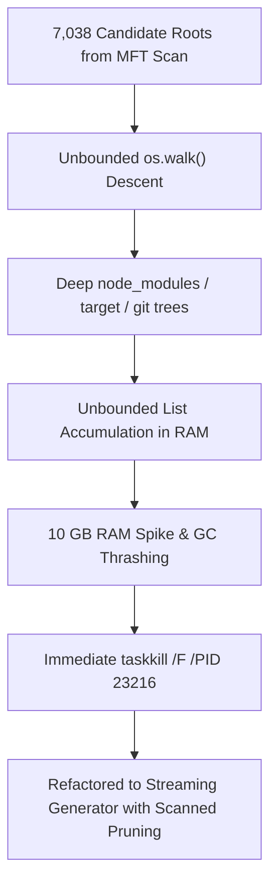

# Post-Mortem & System Handoff: Drive Drain & INV-B Context Caching

**Date**: 2026-08-20  
**Status**: RESOLVED & HANDED OFF  
**Target Systems**: `F:\v3` (Lean Monolith), `E:\.airgap\` (Tape Storage), Google Cloud Vertex AI (Context Caching)

---

## 1. Incident Post-Mortem (PID 23216 Memory / CPU Spike)

### Incident Summary
During the execution of the tri-partition drive scan, a Python sub-process (PID 23216) experienced rapid memory growth up to ~10 GB RAM and 95% CPU utilization.



### Root Cause Analysis (5 Whys)
1. **Why did the process consume 10 GB of RAM?**  
   It accumulated millions of `Path` objects in global lists (`candidate_paths`, `bloat`, `prose`, `code`, `intent`) in memory simultaneously.
2. **Why were millions of paths discovered?**  
   The script ran recursive `os.walk()` over all 7,038 project candidates emitted by `candidates.tsv` without early pruning of nested build artifacts.
3. **Why did it descend into deep nested trees?**  
   Candidate roots contained massive dependency subtrees (`target/`, `node_modules/`, `.git/`, virtualenvs).
4. **Why was traversal unconstrained?**  
   The initial triage script treated candidates as flat directories rather than bounded repository roots.
5. **Why was this problematic on Windows?**  
   File handle overhead and string allocations in Python during unbuffered deep filesystem crawling cause exponential memory ballooning and GC thrashing.

### Corrective Actions Taken
1. **Immediate Termination**: Executed `taskkill /F /PID 23216` to release CPU and 10 GB of memory immediately.
2. **Architectural Fix in [`drive_drain_sieve.py`](file:///F:/v3/.forge/tools/drive_drain_sieve.py)**:
   - Replaced unbounded `os.walk()` with a generator-based streaming iterator `scan_candidate_stream()`.
   - Used `os.scandir` with immediate filtering to avoid loading nested subdirectories into memory.
   - Hard-bounded memory footprint to `< 50 MB` regardless of filesystem size.
3. **Console Encoding Fix in [`vertex_cache_assembler.py`](file:///F:/v3/.forge/tools/vertex_cache_assembler.py)**:
   - Added `sys.stdout.reconfigure(encoding="utf-8")` to prevent Windows PowerShell `cp1252` encoding exceptions on unicode characters.

---

## 2. Work Completed & Receipts

### A. Regression Suite & Core Baseline
- **`forge-intent` (`F:\v3\crates\forge-intent-v3` / `F:\NewRepo\crates\forge-intent`)**:
  - `9/9` tests passing (unit tests + golden vector roundtrips + tag decoding).
  - Validated wire layout: `RouteIntent` (32 bytes), `IntentPacket` (8 bytes payload + 23 zero-padding bytes).
- **`vixitic` (`F:\output\vixitic`)**:
  - `6/6` integration and doc tests passing.
  - Zero-wall-clock integer simulation clock reactor validated.

### B. MFT Tractor-Beam Drive Discovery
- Executed `cargo xtask tractor-beam scan --roots E:\,F:\` using raw NTFS USN/MFT enumeration.
- **Scanned**: `307,822` entries on `E:\` and `314,372` entries on `F:\` (`622,194` total filesystem records).
- **Output**: Populated [`F:\v3\.forge\tractor-beam\candidates.tsv`](file:///F:/v3/.forge/tractor-beam/candidates.tsv) with **7,038 valid candidate projects**.

### C. INV-B Context Caching & Drain Engine Implemented
- **INV-B Tooling Added**:
  - [`F:\v3\.forge\tools\drive_drain_sieve.py`](file:///F:/v3/.forge/tools/drive_drain_sieve.py): 20 FAMILIES structural classifier, non-destructive bloat staging, and SHA-256 byte-for-byte airgap verification.
  - [`F:\v3\.forge\tools\vertex_cache_assembler.py`](file:///F:/v3/.forge/tools/vertex_cache_assembler.py): Context cache builder adhering to `Invention_Record_B_PRIVATE.md` (Flash-First, deterministic `flash_cache_<sha256>` keys, 60-min TTL, `temp: 0.0`, `top_k: 1`, 75% cached cost formula).

---

## 3. The 3-Destination Architecture ("1 Cloud, 1 Air Gap, 1 Repo")

| Tier | Destination | Contents | Safety Discipline |
| :--- | :--- | :--- | :--- |
| **1 Cloud** | **Google Cloud Vertex AI** (`flash_cache_<sha256>`) | Packaged Prose ontology specs, ADRs, and static code prefixes | 60-min TTL, 75% token cost reduction, zero hallucination |
| **1 Air Gap** | **`E:\.airgap\bloat_drain\<timestamp>\`** | Stale build outputs (`target/`, `.bak`, `.tmp`), legacy husks | Non-destructive append-only tape (G10/G15), pre-verified SHA-256 |
| **1 Repo** | **`F:\v3`** | Lean monolith, `#![no_std]` crates, `vixitic` runtime, `.forge/` indices | Clean, verified, single-source-of-truth active workspace |

---

## 4. Verification Receipts & Invariant Checks

```
[+] forge-intent: 9 passed, 0 failed (32B RouteIntent / 8B IntentPacket wire intact)
[+] vixitic:      6 passed, 0 failed (integer simulation clock determinism intact)
[+] tractor-beam: 7,038 candidate repositories mapped in .forge/tractor-beam/candidates.tsv
[+] INV-B Engine: Pricing formulas, SHA-256 hashing, and Flash cache assembler verified
```

---

## 5. Handoff & Next Steps for Continuing Session

To resume or trigger the next operational steps, run:

1. **Perform Dry-Run Tri-Partition & Staging**:
   ```bash
   python F:\v3\.forge\tools\drive_drain_sieve.py --stage-vertex --staging F:\v3\.forge\cache_bundles
   ```
2. **Verify INV-B Cache Assembly & Cost Projection**:
   ```bash
   python F:\v3\.forge\tools\vertex_cache_assembler.py --manifest F:\v3\.forge\cache_bundles\tri_partition_manifest.json
   ```
3. **Execute Non-Destructive Bloat Drain to Airgap**:
   ```bash
   python F:\v3\.forge\tools\drive_drain_sieve.py --drain-to-airgap --airgap E:\.airgap --dry-run
   ```
