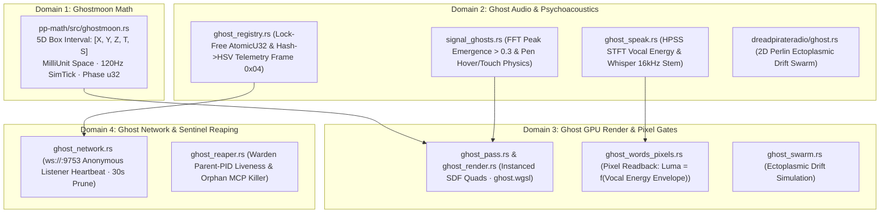

# Onboarding Dossier: v3 Sovereign Workspace & Architecture

Welcome back to the seat of execution. This onboarding dossier provides a comprehensive architectural map, data lineage overview, and current sprint status of the **`F:\v3`** (Sovereign Quarry) workspace as of **August 21, 2026**.

---

## 1. Core Axioms & Rules of the Road

The workspace is governed by absolute structural rules codified in [AGENTS.md](file:///F:/v3/AGENTS.md) and [CLAUDE.md](file:///F:/v3/CLAUDE.md).

### The Workspace Partition
* **`F:\v3` (Sovereign Quarry)**: The active, writeable environment where the code compiles, runs, and tests green.
* **`E:\v3` (Backup Tape)**: An append-only, read-only backup vault containing physical records of prior iterations, airgapped DSP segments, and stale prototypes. Missing files in `F:\v3` are revascularized by reading from `E:\` (Rule **G10**).
* **`.forge/repo-map.tsv`**: The high-density concept map. Every hard-won path, module residence, and structural anchor must be queried here first before starting broad searches (Rule **G02**).

### Development Invariants
* **Zero Ambient Privilege**: Terminal keys and execution routines are transitioning to **WASIBOX sandboxing** (`crates/forge-wasibox-v3` running on `wasmtime`) to prevent raw, ambient parent shell (`pwsh.exe`) access.
* **State-then-Yield (L21)**: Code changes are structured around writing the smallest possible diff, halting, and yielding for validation before proceeding (Rule **G14**).
* **Done-Gate Validation**: Every successful session closure requires two verified outputs: `STATIC` validation (static analysis, compilation, tests passing) and `RUNTIME` validation (pixel readbacks, runtime telemetry traces).

---

## 2. The 14 Ghost Systems: 4-Domain Audit

The "Ghost" architecture consists of 14 discrete systems distributed across four operational domains, bridging interval math, speech synthesis, GPU render pipelines, and network sentinel processes.



### Domain 1: Ghostmoon Math (5D Interval Algebra)
* **Location**: [`F:/NewRepo/crates/pp-math/src/ghostmoon.rs`](file:///F:/NewRepo/crates/pp-math/src/ghostmoon.rs) (145 lines, byte-identical to `E:\v3` archive).
* **Struct**: `Ghostmoon { x0, x1, y0, y1, z0, z1: MilliUnit, t0, t1: SimTick, s0, s1: u32 }`
* **Mathematics**: Operates entirely in pure integer interval operations (`span`, `contains`, `intersects`, `union`) using 120 Hz lockstep clock frames to map spatial-temporal boundaries.

### Domain 2: Ghost Audio, Speech & Psychoacoustics
* **`ghost_speak.rs`**: Extracts vocal energy envelopes using Harmonic-Percussive Source Separation (HPSS) and Short-Time Fourier Transform (STFT) in the $300\text{ Hz}$ to $4\text{ kHz}$ band. Resamples stems to 16kHz mono for speech transcription.
* **`signal_ghosts.rs`**: Spawns spectral particles based on FFT peaks ($> 0.3$). Leverages active input telemetry (pen pressure and hovering height) to attract or scatter particle swarms.
* **`ghost_registry.rs`**: Lock-free concurrent tracking of active spectral entities via `AtomicU32` counters and HSV-to-RGB telemetry.
* **`dreadpirateradio/ghost.rs`**: 2D Perlin noise ectoplasmic swarm drift simulation.

### Domain 3: Ghost GPU Render, Shaders & Hardware Pixel Gates
* **`ghost_pass.rs` / `ghost_render.rs`**: Instanced GPU render passes supporting up to 256 parallel ghosts. It evaluates Signed Distance Fields (SDFs) to draw body contours, glow dynamics, and eye apertures natively. Sub-bass amplitude is routed directly to glow uniforms.
* **`ghost_words_pixels.rs`**: A hardware readback test enforcing visual fidelity. Silent words render dimmed at `alpha = 40/255`, while peak vocal energy spikes alpha to `255/255` (`bright > dim * 1.5`).

### Domain 4: Ghost Network & Sentinel Reaping
* **`ghost_network.rs`**: Privacy-preserving WebSocket node listening on `ws://127.0.0.1:9753` with zero IP logging and 30-second stale pruning.
* **`ghost_reaper.rs`**: Centralized sanitation thread running in `forge-warden` checking active parent PIDs to terminate orphaned `forgeMCP` or subagent environments automatically.

---

## 3. The 5D World: Homogeneous Coordinates in $\mathbb{P}^5$

In order to render affine translations, hyper-rotations, and domain shear operations inside the 5D Pentaract space, coordinates are packed as a homogeneous 6-vector:

$$\mathbf{X}_{5\text{D}} = \begin{pmatrix} X \\ Y \\ Z \\ W \\ V \\ P \end{pmatrix} \in \mathbb{P}^5$$

| Index | Coordinate Lane | Engine Purpose |
| :---: | :--- | :--- |
| **0** | **$X$ (East/West)** | Horizontal spatial coordinate |
| **1** | **$Y$ (Up/Down)** | Gravitational vertical coordinate (`walker5d.fall_tuned`) |
| **2** | **$Z$ (North/South)** | Depth spatial coordinate |
| **3** | **$W$ (Temporal Layer)** | Time/Season/Epoch slice (Layer $0$ surface vs Layer $-1$ subterranean) |
| **4** | **$V$ (Domain/Resonance)** | Hyper-dimensional domain plane (Void, Abyss, Resonance field) |
| **5** | **$P$ (Homogeneous / Parity)** | Affine translation anchor & fixed-point involution residue ($T + T^* = 0$) |

### 10 Planes of Hyper-Rotation
A 5D hyper-cube (Pentaract) has $\binom{5}{2} = 10$ orthogonal rotation planes:
$$(xy,\, xz,\, xw,\, xv,\, yz,\, yw,\, yv,\, zw,\, zv,\, wv)$$
Translations and hyper-rotations are multiplied as a single, unified $6 \times 6$ fixed-point matrix multiplication inside SIMD/GPU registers, bypassing expensive floating-point steps.

### S13 6-Trit Balanced Ternary Packing
To transmit 5D spatial transforms compactly, the six lanes are packed as balanced ternary trits ($\tau \in \{-1, 0, +1\}$):

$$\text{PackedIndex} = \sum_{k=0}^{5} (\tau_k + 1) \cdot 3^k \quad \in [0,\, 728]$$

These 729 discrete states compress into a single 10-bit integer (`u16`), optimized for lockstep netcode transmission.

---

## 4. S13 Quantization, GPU Warden & `S13MatMul`

The engine uses a customized low-bit quantization architecture designed to run high-throughput LLM reasoning locally at the edge on limited hardware (<1.8GB VRAM).

```
+-------------------------------------------------------------------------------+
|                        S13 QUANTIZED TRANSFORMER TRIAD                        |
+-------------------------------------------------------------------------------+
| [Direct Vector Engine] <---> [Mirror Vector Engine] <---> [Codec Transceiver] |
+-------------------------------------------------------------------------------+
|                                      |                                        |
|                          Ternary dot products (-1, 0, +1)                     |
|                          Warp register integer add/sub                        |
|                                      v                                        |
|                         [L1 Decode LUT (243 entries)]                         |
|                                      |                                        |
|                       Realized VRAM: 6.42 Gtok/s throughput                   |
+-------------------------------------------------------------------------------+
```

### Architectural Highlights
1. **`S13MatMul` Multiplication**: Ternary products do not execute float multiplications. They accumulate strictly as integer additions or subtractions in warp registers; the float scale factor is applied exactly once upon dot-product completion.
2. **L1 Decode Cache Line**: A 243-entry decode Look-Up Table (LUT) sits entirely within a single 256-byte L1 CPU cache line / CUDA Shared Memory bank. This delivers **$6.42\text{ Gtok/s}$** decoding speed.
3. **DoubleBufferedVramStaging**: Custom 2x64KB TimelineSemaphores in the GPU Warden (`forge-gpu-warden-v3`) coordinate data loads, enforcing strict Ampere 32x32 workgroup tile contracts.
4. **Sovereign Data Invariant**: Zero raw customer data, images, or telemetry are stored or hosted. Memory blocks are zeroized using SIMD-level instructions on drop (`SIMD-Zeroize`).

---

## 5. Neuro-HUD & Astrolabe Restoration Blueprint

The active frontend interface, the sovereign window ([`shell/src/main.rs`](file:///F:/v3/shell/src/main.rs)), is currently undergoing a critical layout and sandbox recovery.

### The Layout & Focus Drift
Currently, the boot sequence spins up the 5D walker game loop directly, rendering combat environments rather than the Astrolabe HUD. Additionally, terminal shell escape (triggered via `` ` ``) routes to raw ConPTY (`pwsh.exe`) instead of the WASIBOX container.

### The 4-Step Recovery Path
1. **Star Catalog Layering**: Link the 200,000-star binary loader (`celestial_hyg.rs` pulling from `hyg_baked.bin`) to Layer 0 inside the frame compositor ([`shell/src/compose.rs`](file:///F:/v3/shell/src/compose.rs)).
2. **Astrolabe Projection**: Superimpose the circular astrolabe coordinate ring and peripheral limb studs (`hud.rs`) over Layer 0.
3. **WASIBOX Routing**: Route terminal keyboard input sequence to `crates/forge-wasibox-v3` running Wasmtime, isolating guest code from executing parent-system terminal calls.
4. **Boot Pruning**: Place the active 5D walking loop behind a `--dev` flag, booting straight into the Astrolabe HUD and sandbox console.

---

## 6. Google Gemini C2 Competition Strategy

The project is structured to enter the Google Gemini Developer Competition under a highly specialized category stack:

### Identity & Parameters
* **Primary Category**: **C2 (Collaborative Partner)** — Socratic, adaptive, step-by-step Cree language revitalization and mental wellness companion.
* **Corporate Entity**: `2748684 Alberta LTD` (Sean Morin, Corporate Email: `dev@deveraux.dev`).
* **Official Start Date**: `06-01-2026` (signaling the inception of the Gemini Active Governor, S13 Triad, and GPU Warden).

### High-Fidelity Anti-Hallucination Pipeline
To prevent grammatical and morphological drift in indigenous language generation, the pipeline integrates four strict verification boundaries:

$$\text{ASP / Clingo Coordinate Solver} \longrightarrow \text{FST Morphological Realizer} \longrightarrow \text{GBNF Trie / Logit Mask} \longrightarrow \text{Photon 3D Lattice Witness}$$

1. **Answer Set Programming (Clingo)**: Models high-dimensional Algonquian verb dependencies (Animacy, Obviation, and Direction hierarchy $2 > 1 > 3 > 3'$).
2. **Finite State Transducers (ALTLab / itwêwina `crk`)**: Realizes structural coordination matrices into authentic surface forms.
3. **GBNF Grammar Constraints**: Clamps illegal morphosyntactic and schema tokens directly to $-\infty$ probability during LLM logit decoding.
4. **Photon Lattice Rendering**: Visualizes valid word trees on screen within $30$ seconds, providing immediate pixel feedback of compiler-enforced syntax.

---

## 7. Short-Term Actions & Sprint Checklist

- [ ] **Establish sandboxed WASIBOX execution** inside the sovereign shell instead of ambient `pwsh7` loops.
- [ ] **Promote `celestial_hyg.rs` star fields** to Layer 0 inside the main native compositor.
- [ ] **Audit FST license compatibility** for the Plains Cree (`crk` / Giellatekno) dataset.
- [ ] **Draft the 2% Covenant** establishing a Decentralized Autonomous Fund (DAF) for Indigenous language preservation, validated with a Nostr receipt.

---

## 8. 13Forge Studio License, Privacy, & Community Invariants

Based on the verified **13Forge Studio Community License and Roadmap** (audited from [13Forge-Studio.pdf](file:///F:/v3/13Forge-Studio.pdf)):

### Legal & Ownership Framework
* **Sovereignty**: Copyright © 2026 Sean Morin / 2748684 Alberta Ltd., Beaver Lake Cree Nation, Treaty 6 (contact: `dev@deveraux.dev`).
* **Usage Rights**: Users have the unrestricted right to run 13Forge Studio for any purpose, install it on unlimited machines, and keep, sell, or share everything they create. Users own 100% of their creations, exports, and files outright.
* **Limitations**: Users may not reverse engineer, decompile, extract source code, sell/sublicense the engine itself, or remove license or copyright declarations.

### Core Architecture & Privacy Mandates
* **No Telemetry / No Collection**: 13Forge Studio collects **absolutely nothing**—no accounts, no sign-ups, no tracking analytics, and no mandatory internet connection. Files and assets reside strictly local to the user's local filesystem.
* **Opt-In Marketplace**: Any future marketplace features are strictly opt-in, maintaining full provenance records honoring creator identity with zero platform fees or middleman shares.
* **2% Community Healing Fund**: A permanent operational rule ensuring that **2% of all company revenue** (not profit, but gross revenue, before any salaries or expenses) is distributed to a community healing fund.

