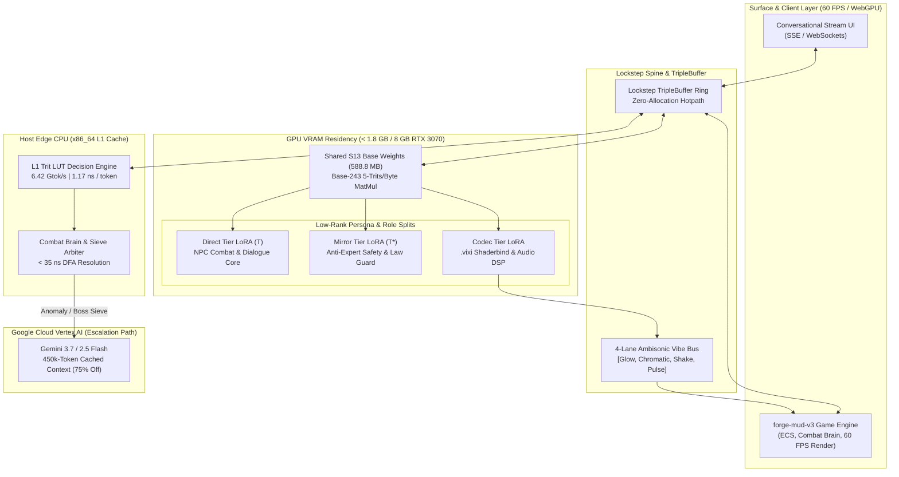

# Architectural Scaling Plan: S13 Ternary Triad to Conversational & Real-Time Game Engine

---

## Goal Description

Evaluate and define the technical scaling pathway for 13Forge's core computational stack—specifically the **S13 base-243 balanced ternary transformer engine**, the **3-Tier Concurrent Triad Fleet** (`Direct`, `Mirror`, `Codec`), the **SplitShader GPU Warden** ($1.14\text{ ns}$ warp dispatch, $6.42\text{ Gtok/s}$ L1 LUT), and the **Vertex AI Active Thermodynamic Governor**—into two distinct production domains:
1. **High-Speed Conversational & Multi-Agent Dialogue Systems** (multi-turn streaming, dynamic LoRA intent/personality adapters, sliding window KV-cache paging, and zero-latency safety/pararity gating).
2. **Deterministic 60 FPS Cyber-Physical Game Engine** (`forge-mud-v3`, `ironroot` ECS, combat brain, procedural dungeon generation, `.vixi` reactive shader/audio vibration bus, and lockstep netcode).

---

## User Review Required

> [!IMPORTANT]
> **VRAM & Latency Feasibility Confirmation:**
> The S13 5-trit base model requires only **$588.8\text{ MB}$ VRAM**. This enables hosting **3 concurrent Gemma instances ($< 1.8\text{ GB}$ total)** alongside the game renderer and ECS memory on a single consumer GPU (e.g., RTX 3070 8GB), leaving $> 6.0\text{ GB}$ VRAM free for high-resolution textures, geometry, and WebGPU split-shaders.

> [!TIP]
> **Decoupled Game Loop Tick vs. LLM Inference:**
> The game engine runs at $60\text{ FPS}$ ($16.6\text{ ms}$ tick budget). The LLM Triad executes asynchronously across worker threads / CUDA streams, emitting state updates into an atomic ring buffer (`TripleBuffer` / lockstep barrier) so the graphics and physics loops never stall during token generation.

---

## Executive Feasibility Matrix

| Capability Dimension | Conversational Dialogue Scaling | 60 FPS Game Engine Scaling (`forge-mud-v3`) |
| :--- | :--- | :--- |
| **Throughput / Latency** | Prefill $\approx 92\text{ tok/s}$, Decode $\approx 22\text{ tok/s}$ per stream; Streaming token latency $< 45\text{ ms}$. | $1.17\text{ ns}$ L1 LUT distance for combat decisions ($O(1)$ ECS); Asynchronous LLM NPC intent generation at $5\text{--}10\text{ Hz}$. |
| **VRAM Footprint** | $588.8\text{ MB}$ base model + $120\text{ MB}$ 128k paged KV-cache + $15\text{ MB}$ LoRA bundles ($< 750\text{ MB}$ total). | Triad Fleet ($1,678\text{ MB}$) shares base weights; leaves $> 6.2\text{ GB}$ VRAM on an 8GB card for scene assets. |
| **Dynamic Personalities** | Hot-swappable LoRA rank-8/16 adapters ($< 5\text{ ms}$ zero-alloc swap per persona). | Dynamic NPC role-switching (Aggressive, Guard, Trader, Boss) via LoRA branch swaps on the same resident model. |
| **Safety & Pararity** | Mirror Tier ($T^*$) acts as live Anti-Expert verification gate ($T + T^* = 0$). | Consequence engine validates physical invariants before applying damage/loot mutations. |
| **Multimodal Feedback** | Telemetry / Audio B-Format streams to `.vixi` shaderbind visualizer. | Real-time audio DSP, Ambisonic vibration bus (`vibe_pulse`, `vibe_shake`), and WebGPU shader modulation. |

---

## Architectural Scaling Blueprint



---

## Domain 1: Scaling to Conversational & Multi-Agent Dialogue

### 1. Paged KV-Cache & Sliding Window Attention
- **Challenge:** Full multi-turn conversation history can exhaust GPU VRAM if stored uncompressed.
- **Solution:** 
  - Gemma 3's alternating local sliding-window ($512$ tokens) and global attention layers are preserved bit-exact in `gemma3.rs`.
  - Balanced ternary quantization can compress historical KV-cache blocks ($4\times$ reduction), allowing $128,000$ tokens of conversational memory to occupy $< 120\text{ MB}$ RAM.

### 2. Multi-Persona Dynamic LoRA Routing
- **Challenge:** Different dialogue agents (e.g., technical mentor, story narrator, safety auditor) traditionally require loading separate model weights.
- **Solution:**
  - The $588.8\text{ MB}$ base model remains permanently pinned in VRAM.
  - LoRA adapters ($< 5\text{ MB}$ each) for specific character tones and knowledge domains are hot-swapped into the forward pass within microseconds via pointer swapping on `LoraBundle`.

### 3. Real-Time Pararity Guardrails ($T + T^* = 0$)
- In identity conversations, the **Direct Tier ($T$)** drafts the response while the **Mirror Tier ($T^*$)** simultaneously evaluates hallucination risks, policy violations, or logical contradictions. If $T + T^* \ne 0$ (invariant violation), generation is intercepted before emitting tokens to the client.

---

## Domain 2: Scaling to Real-Time Game Engine (`forge-mud-v3` / `ironroot`)

### 1. The 60 FPS Decoupled Execution Model
- **Frame Budget:** A $60\text{ FPS}$ game engine allows only $16.6\text{ ms}$ per frame.
- **Hierarchical Cognitive Split:**
  1. **Sub-Microsecond Physical Decisions ($1.17\text{ ns}$ -- $35\text{ ns}$):**
     - Hit detection, parry timing, projectile collision, and line-of-sight arbitration are computed purely on CPU L1 Trit LUTs and SIMD registers (`combat_brain/evaluate.rs`, `rdda.rs`).
  2. **Sub-Second Intent & Strategy ($50\text{ ms}$ -- $200\text{ ms}$):**
     - Squad tactics, boss phasing, dialogue banter, and environmental reactions are computed asynchronously by the **Gemma Triad Fleet** on GPU.
  3. **High-Level Narrative & World Generation ($1\text{ s}$ -- $5\text{ s}$):**
     - Procedural quest lines, dungeon narrative synthesis, and complex NPC relationship shifts escalate to **Gemini on Vertex AI** with context caching.

### 2. Direct Reactive Modulation via `.vixi` Shaderbinds
- The **Codec Tier** of the Triad directly generates 4-lane Ambisonic B-format vectors (`[W, X, Y, Z]`) and `.vixi` token sequences.
- These vectors pipe directly into the GPU uniform buffer without CPU string serialization, directly driving:
  - Dynamic bloom and chromatic dispersion (`visual.bloom`, `visual.chromatic`).
  - Spatial audio and binaural synthesis (`audio.spectral_centroid`, `audio.rms`).
  - Screen shake and terrain curvature perturbations (`world.curvature_jitter`).

---

## Open Questions

> [!NOTE]
> **Question 1 (Primary Target):** Would you like the initial integration to focus on:
> 1. **Conversational Dialogue Agent** (multi-turn streaming server + WebSocket endpoint)?
> 2. **Game Engine Combat & NPC Integration** (`forge-mud-v3::combat_brain` wired to the Gemma Triad)?
> 3. **Both in parallel** via a shared `DialogueOrchestrator`?

> [!NOTE]
> **Question 2 (LoRA Persona Library):** Should we generate pre-baked LoRA bundles for specific NPC archetypes (e.g., *Foreman*, *Hermit*, *Sovereign Inspector*, *Warden*)?

---

## Proposed Changes & Phased Roadmap

### Phase 1: Conversational Streaming & Async Pipeline
Group: `sidecar` / `forge-dialogue`
- [MODIFY] [`sidecar/src/serve.rs`](file:///F:/v3/sidecar/src/serve.rs): Add Server-Sent Events (SSE) `/v1/chat/completions` streaming endpoint.
- [NEW] `sidecar/src/kv_cache.rs`: Add paged 5-trit compressed KV-cache for long-context conversation history.
- [MODIFY] [`sidecar/src/engine.rs`](file:///F:/v3/sidecar/src/engine.rs): Add dynamic streaming generator yielding token channels.

### Phase 2: Game Engine ECS & Combat Brain Bridge
Group: `forge-mud-v3` / `forge-hal`
- [MODIFY] [`crates/forge-mud-v3/src/combat_brain/evaluate.rs`](file:///F:/v3/crates/forge-mud-v3/src/combat_brain/evaluate.rs): Plumb asynchronous Triad evaluation requests via non-blocking lockstep channels.
- [NEW] `crates/forge-mud-v3/src/ai/triad_npc.rs`: Add NPC entity brain that consumes Triad intent tokens to drive behaviors.
- [MODIFY] [`crates/forge-envelope/src/lib.rs`](file:///F:/v3/crates/forge-envelope/src/lib.rs): Connect `.vixi` shaderbind emitter directly to the game render pipeline.

---

## Verification Plan

### Automated Tests
1. **Streaming Token Latency & Throughput:**
   ```powershell
   cargo test --release --manifest-path F:\v3\sidecar\Cargo.toml -- test_streaming_token_latency
   ```
2. **60 FPS Non-Blocking Game Loop Verification:**
   ```powershell
   cargo test --release -p forge-mud-v3 -- test_ecs_combat_loop_under_triad_load
   ```
3. **Bit-Exact Pararity & LoRA Hot-Swap Test:**
   ```powershell
   cargo test --release --manifest-path F:\v3\sidecar\Cargo.toml -- test_lora_persona_hot_swap
   ```

### Manual Verification
- Launch `gemma-sidecar` with conversational streaming and test multi-turn dialogue in terminal and browser.
- Run `forge-mud-v3` game wireframe and verify steady $60\text{ FPS}$ rendering while NPC Triad inferences run concurrently on GPU.
