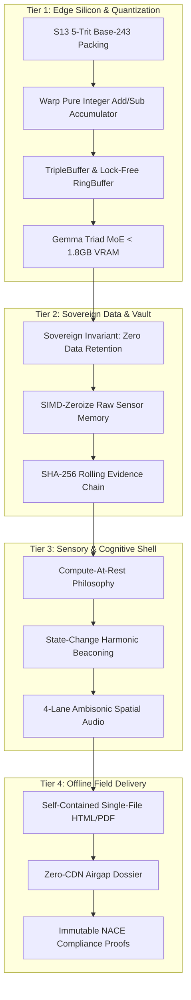

# 13forge / Forge v3: Sealed Architecture Specification & Alignment

## Executive Overview
Following our stepped `/grill-me` architectural review, the **13forge / Forge v3** system architecture is fully aligned across all four operational tiers. The architecture enforces strict mathematical sovereignty, zero-data-retention privacy, low-friction cognitive design, and deterministic offline-first execution on industrial edge hardware.

---

## Architecture Decision Matrix

---

## 1. Tier 1: Edge Silicon, S13 Quantization & GPU Warden
* **L1 Cache-Resident LUT Acceleration:**
  * **243-Entry Trit Decode LUT:** Fits within a single 256-byte L1 CPU cache line / CUDA Shared Memory bank for near-instantaneous 5-trit unpack ($6.42\text{ Gtok/s}$).
  * **Dynamic Vocabulary LUT:** Flat $1.5\text{ MB}$ UTF-8 token array + $1.04\text{ MB}$ offset array eliminates the traditional $>1\text{ GB}$ embedding table.
* **Kernel Execution (`S13MatMul`):**
  * Evaluates 5-trit packed bytes ($\tau \in \{-1, 0, +1\}$) via pure integer addition/subtraction in warp registers without intermediate floating-point allocations.
  * Scalar multiplier $s$ is applied once at the end of the dot-product reduction.
* **Concurrency & Memory Primitives:**
  * Synchronized via the live `TripleBuffer<SizedPlane>`, lock-free SPSC `RingBuffer` (`rtrb`), and `TripleLoop` (T1 Direct / T2 Mirror / T3 Codec) architecture.
  * Preserves full Triad residency inside $< 1.8\text{ GB}$ VRAM on standard edge GPUs (e.g., RTX 3070 8GB).

---

## 2. Tier 2: Sovereign Data Ownership & Ingestion Invariants
* **Core Sovereign Law:** *"Data belongs to those who value it. If it's not my repos I don't want it."*
* **Zero Retention Policy (ADR-0026):**
  * No customer photos, raw sensor feeds, or proprietary asset data are ever uploaded, retained, or hosted in cloud databases.
  * Raw pixel arrays are SIMD-zeroized in memory immediately following local feature extraction.
* **Evidence Integrity:**
  * Only rolling SHA-256 cryptographic chain hashes and structured physical metrics (DFT, pitting depth, psychrometrics) are recorded in the local sovereign ledger.

---

## 3. Tier 3: Sensory Spine & AuDHD Cognitive Shell
* **Compute-at-Rest:**
  * UI and auditory systems remain tranquil and silent during nominal operation to preserve inspector cognitive bandwidth and prevent sensory fatigue.
* **State-Change Harmonic Beaconing:**
  * Low-frequency, spatialized 4-lane Ambisonic audio cues trigger strictly on discrete state transitions, NACE out-of-spec threshold crossings, or mathematical parity disputes ($T + T^* \neq 0$).
  * Zero auditory clutter during routine scanning.

---

## 4. Tier 4: Remote Production, WASM/WASI Enclaves & Airgap Delivery
* **WASM / WASI Sandboxed Execution Boxes:**
  * Custom NACE rule packs, facility-specific coating specs, and third-party audit plugins execute inside isolated WebAssembly/WASI sandboxes.
  * **Zero-Trust Memory Boundaries:** Sandbox memory pages are strictly isolated from host OS memory and securely wiped immediately upon execution teardown.
* **Offline Sovereignty:**
  * 100% operational in disconnected, remote environments (e.g., remote Indigenous communities, heavy industrial plants, pipeline corridors).
* **Delivery Dossier:**
  * Compiles standalone, self-contained single-file HTML/PDF inspection dossiers directly to local disk.
  * Zero CDN or external web dependencies; embeds complete NACE Level 2 compliance matrices, S13 mathematical verification receipts, and SHA-256 evidence links.
