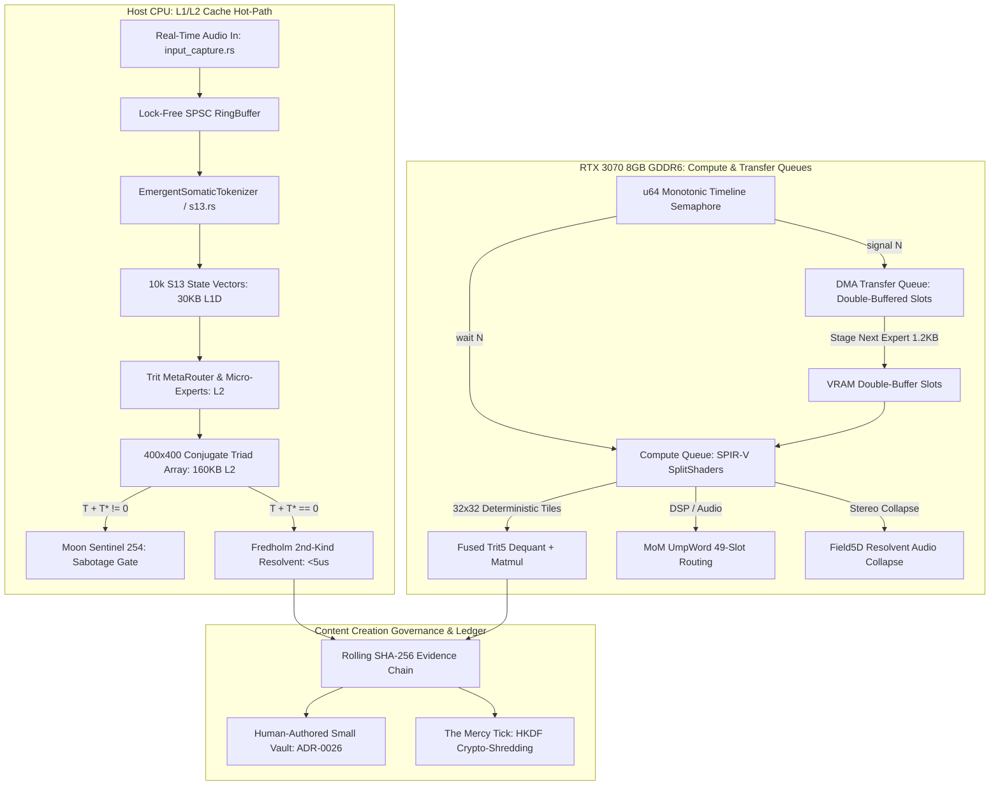

# IMPLEMENTATION PLAN: Sovereign Multimedia Engine & GPU/CPU SplitShader Architecture

**Date:** 2026-08-19  
**Author:** Antigravity (Pair Programming with Sean Morin)  
**Status:** DRAFT — Awaiting Sean's Review & Approval  
**Target Crates:** `forge-envelope`, `forge-audio` (`crates/forge-audio-v3`), `forge-gpu-warden-v3`, `sidecar`, `forge-core-v3`  

---

## 1. Goal Description

This plan unifies the discoveries, mathematical formulations, and hardware architectures established across this session into a singular, actionable implementation blueprint. It connects:

1. **Sub-Microsecond S13 Gemma Quantization & Cache Pinning:** Fitting 10,000 live S13 agents in L1 Data Cache ($30\text{ KB}$) and 400 ternary micro-experts in L2 Cache ($480\text{ KB}$).
2. **Fredholm-Janus Invariant Array ($400 \times 400$):** 1st-to-2nd kind resolvent regularization $(\mathbf{I} - \lambda \mathbf{K})\boldsymbol{\phi} = \mathbf{f}$, Janus point critical mode collapse, and conjugate triad gauge anchors ($T + T^* = 0$) evaluated in $<5\,\mu\text{s}$ within L2 cache.
3. **RTX 3070 Edge-Metal GPU Acceleration:** SplitShader hybrid execution leveraging 8GB VRAM (streaming up to 2.24 Trillion ternary weights/sec), timeline semaphore monotonically gated DMA hotswaps, and bit-exact deterministic 32x32 / 64x64 SPIR-V compute kernels.
4. **Offline Multimedia Creation & Content Governance:** Real-time audio DSP (MoM `UmpWord` 49-slot routing, Field5D Fredholm stereo collapse), somatic photometric encoding, and cryptographic self-attestation (ADR-0026, Evidence Chain, Mercy Tick crypto-erasure).
5. **Real-Time Input Capture Seam:** Lock-free SPSC audio capture (`input_capture.rs` / `C:\Users\seanm\Desktop\realtime_input.rs`) feeding live streams into the sovereign engine.

---

## 2. System Architecture & Component Interaction



---

## 3. User Review Required

> [!IMPORTANT]
> **Strict Integration Gate:** Per your explicit standing rule (*"no Engine and Lineage Integration other than what I approve"*), this plan details architecture and file alignment only. No modifying code or unapproved integration steps will be executed without your explicit instruction.

> [!NOTE]
> **Audio Input Capture Status:** `C:\Users\seanm\Desktop\realtime_input.rs` is already mirrored in `crates/forge-audio-v3/src/input_capture.rs` (using safe `device_info::AudioDeviceInfo` to bypass the excluded unsafe `realtime.rs` module). Automated unit tests are verified green.

---

## 4. Work Breakdown & Proposed Phasing

### Phase A: Audio Input & Somatic Ingest Wiring
* **Objective:** Ensure real-time audio input capture from `input_capture.rs` streams lock-free samples into the somatic tokenizer and MoM event bus.
* **Key Files:**
  * [`crates/forge-audio-v3/src/input_capture.rs`](file:///F:/v3/crates/forge-audio-v3/src/input_capture.rs) (Capture handle, SPSC ring buffer, `DAW_NO_AUDIO` bypass).
  * [`crates/forge-audio-v3/src/device_info.rs`](file:///F:/v3/crates/forge-audio-v3/src/device_info.rs) (Safe `AudioDeviceInfo` home).
  * [`crates/forge-envelope/src/somatic_tokenizer.rs`](file:///F:/v3/crates/forge-envelope/src/somatic_tokenizer.rs) (Audio/telemetry to S13 vector normalization).

### Phase B: $400 \times 400$ Fredholm-Janus Array & S13 Cache Optimization
* **Objective:** Implement the $400 \times 400$ conjugate triad array with L2 cache residency ($160\text{ KB}$), fast involutive flipping ($<2\,\mu\text{s}$), and Fredholm 2nd-kind resolvent regularization $(\mathbf{I} - \lambda \mathbf{K})^{-1}$.
* **Key Files:**
  * [`crates/forge-envelope/src/s13.rs`](file:///F:/v3/crates/forge-envelope/src/s13.rs) (Extend `TriadStream` / `DifferentialTriad` to $400 \times 400$ grid evaluations).
  * [`crates/forge-core-v3/src/resolvent.rs`](file:///F:/v3/crates/forge-core-v3/src/resolvent.rs) (Neumann series expansion and spectral criticality trigger).

### Phase C: SplitShader SPIR-V Determinism & Timeline Semaphore Hotswaps
* **Objective:** Construct the Vulkan/DirectX12 timeline semaphore hotswap bridge and 32x32 deterministic SPIR-V compute kernels for the RTX 3070.
* **Key Files:**
  * [`crates/forge-gpu-warden-v3/src/fence.rs`](file:///F:/v3/crates/forge-gpu-warden-v3/src/fence.rs) (Tick-monotonic `DispatchFence` alignment).
  * [`sidecar/src/tier3_cuda.rs`](file:///F:/v3/sidecar/src/tier3_cuda.rs) & SPIR-V shader source (32x32 warp-aligned deterministic GEMM).
  * [`sidecar/src/tier_dispatch.rs`](file:///F:/v3/sidecar/src/tier_dispatch.rs) (Double-buffered DMA weight staging and lock-free execution).

### Phase D: Content Creation Governance & Evidence Sealing
* **Objective:** Connect generative multimedia outputs to the rolling SHA-256 evidence chain, Mercy Tick crypto-erasure, and $T + T^* = 0$ safety gating.
* **Key Files:**
  * [`crates/forge-envelope/src/lib.rs`](file:///F:/v3/crates/forge-envelope/src/lib.rs) (`EvidenceChain`, `ChainLink`, `Disposition` trits).
  * [`crates/forge-envelope/src/mom.rs`](file:///F:/v3/crates/forge-envelope/src/mom.rs) (MoM router event tagging and attestation).

---

## 5. Verification & Testing Plan

### Automated Tests
1. **Audio Input Suite:**
   ```powershell
   cargo test -p forge-audio input_capture
   ```
2. **S13 & Differential Triad Suite:**
   ```powershell
   cargo test -p forge-envelope s13
   ```
3. **GPU Tier Dispatch & CUDA Parity:**
   ```powershell
   cargo test --manifest-path sidecar/Cargo.toml tier_dispatch
   cargo test --manifest-path sidecar/Cargo.toml tier3_cuda
   ```
4. **Full Workspace Health Gate:**
   ```powershell
   cargo check --workspace
   ```

### Manual Verification
* Inspect device enumeration via `input_capture::list_input_devices()`.
* Validate that `DAW_NO_AUDIO=1` allows headless deterministic testing without physical audio hardware.
* Measure L1/L2 cache residency and execution latency using hardware performance counters.
