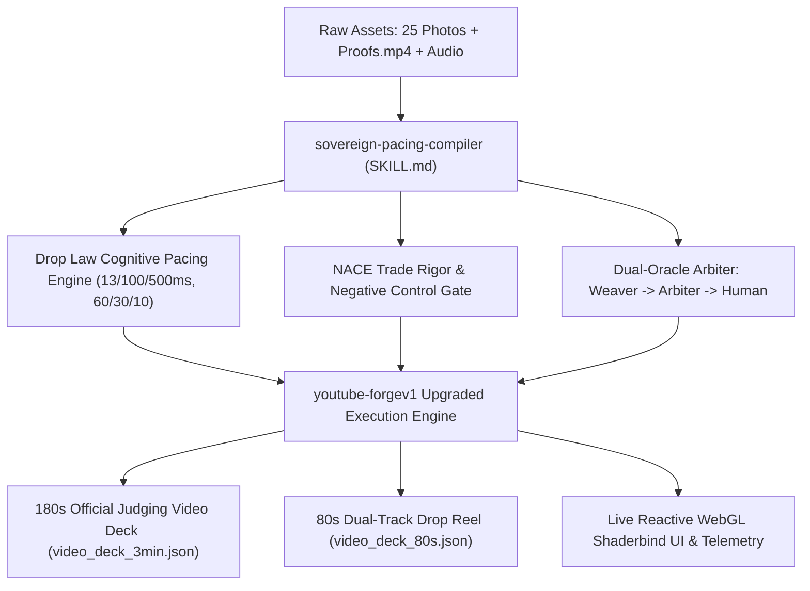

# Implementation Plan: Sovereign Pacing Compiler & YouTube-Forge v1 Upgrade

## Goal Description
Build the production-grade **`sovereign-pacing-compiler`** AI agent skill and upgrade the existing **`youtube-forgev1`** skill to deliver a competition-winning, reusable video/reel generation pipeline for the Google Gemini Developer Competition & All Things Agentic (ending August 29th). 

The system synthesizes:
1. **The Drop Law Cognitive Pacing Engine**: Frame-accurate dwell rates (13ms flicker, 100ms read, 500ms kept), 200–500ms blink gating, 65/20/15 action vs. contemplative transition ratios, Kishōtenketsu 60/30/10 macro arcs, wordless pillow shot cognitive resets, 3/4/5 structural repeat cadence, saga understatement, and auDHD reader-clocked mechanics.
2. **Trade-Rigor & Personal Invariants**: Sean Morin's 23-year NACE/SSPC coatings inspection discipline (Walterdale Bridge, Suncor, Fort McMurray, C-Train), negative control laws (`determinism_proof.rs` / `material_canvas_proof`), zero-prose/zero-fluff mathematical attestation, and Koestler bisociation (Physical Craft $\times$ Rust Low-Level Systems $\to$ Surface Ledger).
3. **Mathematical & Dual-Oracle Foundations**: Fixed-point Permyriad Fredholm 2nd kind integral equations, sub-critical coupling ($\lambda < 1/\sigma_{\text{max}}$), 2 KB context sipping with 64-byte BQ-Hamming hashes, thermodynamic GPU logit masking ($-\infty$), 5D manifold identity $(\theta, \phi, r, z, \text{identity})$, and Weaver $\to$ Arbiter dual-oracle gating (ANCHOR $\times$ CITED $\times$ REACH: 0 SAME, 1 ADJACENT, 2 CROSS).
4. **Reusable 25-Photo + Proofs.mp4 Asset Pipeline**: Deterministic binding of all 25 verified physical job-site photos and screen captures across the 180.0-second competition judging walkthrough and 80.0-second Kishōtenketsu reel.

---

## User Review Required

> [!IMPORTANT]
> **Skill Locations & Dual Integration:**
> - `sovereign-pacing-compiler` will be authored as a new, canonical theory-compiler skill in [`F:\NewRepo\.claude\skills\sovereign-pacing-compiler\SKILL.md`](file:///F:/NewRepo/.claude/skills/sovereign-pacing-compiler/SKILL.md), adhering strictly to the `theory-engine-compiler` schema.
> - `youtube-forgev1` in [`F:\NewRepo\.claude\skills\youtube-forgev1\SKILL.md`](file:///F:/NewRepo/.claude/skills/youtube-forgev1/SKILL.md) will be updated to eliminate its 50ms (300 BPM) uniform dwell defect, wire `sovereign-pacing-compiler` as its cognitive rhythm governor, and incorporate the 25-photo asset library and video deck generator.

> [!TIP]
> **Photo Asset Resolution & Paths:**
> All 25 photos and `Proofs.mp4` listed in [`HANDOFF-2026-08-20-DURABLE-FULL-CONTEXT-KOESTLER-PHOTO-ASSETS.md`](file:///F:/v3/TODO/handoffs/HANDOFF-2026-08-20-DURABLE-FULL-CONTEXT-KOESTLER-PHOTO-ASSETS.md) are grounded against their actual disk locations (`C:\Users\seanm\Pictures\...`, `D:\SEANPHONEPHOTOSDND\...`, `C:\Users\seanm\Desktop\Proofs.mp4`). The generator script will assert their existence and emit structured scene manifests with aspect-ratio and normal-vector metadata.

---

## Open Questions

> [!NOTE]
> 1. **TTS Voice Preference for Reel Narration:**
>    - Existing `youtube-forgev1` traces Kokoro ONNX (`bf_lily` / `bf_alice` British public-information register for hauntology or `am_adam` / `af_bella`).
>    - For the competition entry, does Sean prefer live recorded voiceover (center speech) over an f64 MoM soundscape, or an automated Kokoro synthesis run with organum pentatonic drone support? *(The skill will support both paths seamlessly).*

---

## Proposed Changes



---

### Component 1: `sovereign-pacing-compiler` Skill

#### [NEW] [`F:\NewRepo\.claude\skills\sovereign-pacing-compiler\SKILL.md`](file:///F:/NewRepo/.claude/skills/sovereign-pacing-compiler/SKILL.md)
* Canonical skill file matching the `theory-engine-compiler` schema.
* **YAML Frontmatter**:
  ```yaml
  ---
  name: sovereign-pacing-compiler
  description: Compiles cognitive pacing (Drop Law), trade-rigor attestation, Fredholm field mechanics, and Prime Symbiosis dual-oracle gating into machine-usable rules, validation gates, and pipeline execution schemas.
  ---
  ```
* **Firing Contract**:
  - `FIRE=line1 [sovereign-pacing-compiler | <target>]`
  - Visible execution, zero silent errors, and RED-first crucible pass.
* **Complete `KG_RULE` Set** (Structured across Pacing, Trade-Rigor, and Prime Symbiosis):
  - `KG_RULE: droplaw.dwell.hierarchy` (13ms subliminal flicker, 100ms transient motion, 500ms kept plot keyframe floor).
  - `KG_RULE: droplaw.blink.gate` (200–500ms keyframe collision avoidance and load-bearing hold).
  - `KG_RULE: droplaw.transition.ratios` (65/20/15 action vs. contemplative aspect runs).
  - `KG_RULE: droplaw.arc.kishotenketsu` (60/30/10 macro arc with wordless pillow shot resets).
  - `KG_RULE: droplaw.structural.repeats` (3, 4, 5 structural iterations landing outcome on final iteration).
  - `KG_RULE: droplaw.saga.understatement` (Highest stakes $\to$ flattest narrative line).
  - `KG_RULE: droplaw.audhd.reader_clock` (Press-to-step advance, wordless visual syntax carrying memory).
  - `KG_RULE: trade.nace.coating_discipline` (23-year NACE/SSPC empirical standards, DFT, dew point, blast profile).
  - `KG_RULE: trade.negative_control.proof` (Negative control law: prove test catches failure before passing).
  - `KG_RULE: trade.zero_fluff.ledger` (Zero-prose, non-repudiable mathematical ledger facts).
  - `KG_RULE: prime.fredholm.resolvent` (Fredholm 2nd kind kernel $g(x) = f(x) + \lambda \int K(x,y)f(y)dy$ in fixed-point Permyriads with sub-critical $\lambda$).
  - `KG_RULE: prime.context.sipping` (2 KB per-step attention ceiling, 64-byte BQ-Hamming hashes).
  - `KG_RULE: prime.thermodynamic.logit_mask` ($-\infty$ GPU tensor masking of non-RON/non-structural tokens).
  - `KG_RULE: prime.manifold.5d_identity` ($(\theta, \phi, r, z, \text{identity})$ lossless mapping across river, audio, and engine).
  - `KG_RULE: prime.dual_oracle.arbiter` (Weaver proposer $\to$ Arbiter mechanical gate with ANCHOR $\times$ CITED $\times$ REACH rubric $\to$ Human ratifier).
  - `KG_RULE: koestler.bisociation.holon` (Somatic Craft $\times$ Rust Low-Level Systems $\to$ Surface Ledger Holarchy).
* **5 Mandatory Friction Guards**:
  1. *Pacing alone must not dictate narrative weight.*
  2. *Colour alone must not determine material.*
  3. *Music alone must not determine identity.*
  4. *Movement alone must not determine mass.*
  5. *Flow optimization must not erase style or trade-rigor.*
* **Compiler Mapping Tables & Quality Gates**:
  - Dwell Rate Floor Matrix.
  - Transition Ratio Matrix.
  - Dual-Oracle Collision Matrix (ANCHOR $\times$ CITED $\times$ REACH: 0 SAME, 1 ADJACENT, 2 CROSS).
  - Automated `cargo check` / `cargo test` discriminator gates (`# ![deny(unsafe_code)]`, S13, timeline semaphore).

---

### Component 2: `youtube-forgev1` Skill Upgrade

#### [MODIFY] [`F:\NewRepo\.claude\skills\youtube-forgev1\SKILL.md`](file:///F:/NewRepo/.claude/skills/youtube-forgev1/SKILL.md)
* Eliminate the 50ms / 300 BPM uniform dwell defect documented in the trace.
* Wire `sovereign-pacing-compiler` as the upstream governor for all reel clocks (`ReelClock::DROP` set to 30 BPM / 500ms kept dwell).
* Ground the 25 verified photo assets (`C:\Users\seanm\Pictures\...`, `D:\SEANPHONEPHOTOSDND\...`) and `Proofs.mp4` into the asset pipeline.
* Integrate the dual-track 180s judging walkthrough (`VIDEO_3MIN_SCRIPT.md`) and 80s Kishōtenketsu reel generators.
* Retain the ghost voice organum mix (Kokoro ONNX speech + pentatonic Cree vowel camera steering).

---

### Component 3: Video Deck & Photo Asset Automation

#### [MODIFY] [`F:\v3\crates\forge-envelope\scripts\generate_video_deck.py`](file:///F:/v3/crates/forge-envelope/scripts/generate_video_deck.py)
* Add photo asset presence validator for all 25 photos and `Proofs.mp4`.
* Enrich `VideoScene` schema with photo file paths, aspect ratios, Drop Law dwell timestamps, and normal vector metadata.
* Ensure exported JSON decks (`video_deck_3min.json`, `video_deck_80s.json`) can be consumed directly by `story_render.rs` and web dashboards.

---

## Verification Plan

### Automated Tests
1. **Workspace Compilation & Safety Checks:**
   ```powershell
   cargo check --workspace
   cargo test -p forge-envelope -p forge-gpu-warden-v3 -p forge-ml-bqrouter
   ```
   *Expected:* 140/140 unit and integration tests passing under `#![deny(unsafe_code)]`.

2. **Video Deck Generation & Photo Asset Path Validation:**
   ```powershell
   python F:\v3\crates\forge-envelope\scripts\generate_video_deck.py
   ```
   *Expected:* All 25 photo paths verified on disk; `video_deck_80s.json` and `video_deck_3min.json` generated successfully in `F:\v3\crates\forge-envelope\surfaceledger\`.

3. **Vertex AI Multimodal Schema Check:**
   ```powershell
   python F:\v3\crates\forge-envelope\scripts\vertex_schema_client.py
   ```
   *Expected:* Gemini 3.7 Flash structured output validated against Pydantic schema.

### Manual Verification
1. Review generated `SKILL.md` files against the canonical `theory-engine-compiler` schema to ensure 100% compliance with G01, G02, G08, and G14 rules.
2. Confirm that each photo asset in the deck maps accurately to its chapter and narrative beat as specified in [`HANDOFF-2026-08-20-DURABLE-FULL-CONTEXT-KOESTLER-PHOTO-ASSETS.md`](file:///F:/v3/TODO/handoffs/HANDOFF-2026-08-20-DURABLE-FULL-CONTEXT-KOESTLER-PHOTO-ASSETS.md).
