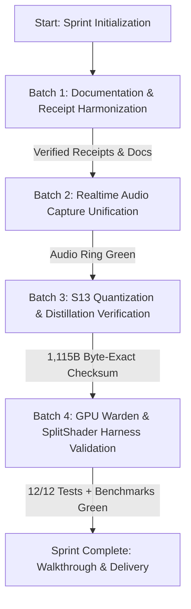

# Implementation Plan: Gemma Trinity S13 & Hybrid Push Sprint

## Goal Description
Execute the **S13 Gemma Trinity, GPU/CPU Hybrid & Sprint Readiness Plan** through a sequence of 4 isolated, specialized `flash_lite` subagent batches. The goal is to harmonize technical receipts and submission documentation, verify audio capture subsystem integration, validate S13 ternary quantization and distillation against canonical checkpoints, and lock down the GPU Warden Vulkan staging and timeline semaphore harnesses without context bloating.



---

## User Review Required

> [!IMPORTANT]
> **Subagent Execution Model**: Per rule **G17** (`sequential-batched`) and prompt instruction, each batch will be dispatched to an isolated `flash_lite` subagent. Each batch must report back and verify green before the next batch is spawned.

> [!NOTE]
> **No Invasive Code Overhauls**: The primary codebase (including `forge-audio-v3`, `forge-gpu-warden-v3`, `forge-core-v3`, and `forge-envelope`) is already in a high state of completion (green tests across all modules). The sprint focuses on rigorous validation, receipt matching, and alignment.

---

## Open Questions

> [!NOTE]
> Are there any specific additional benchmark gates or metrics beyond the measured Ampere 874 Mplans/s (1.14 ns) and L1 856 Mtok/s single-core throughput you want added to `SUBMISSION_ENTRY.md` or `VIDEO_3MIN_SCRIPT.md` during Batch 1?

---

## Proposed Changes

### Batch 1: Documentation & Receipt Harmonization (`flash_lite`)
**Focus**: Align submission entries, 3-minute video voiceover scripts, and architectural documentation with live verified test receipts and cost metrics.

#### [MODIFY] [`crates/forge-envelope/docs/SUBMISSION_ENTRY.md`](file:///F:/v3/crates/forge-envelope/docs/SUBMISSION_ENTRY.md)
* Reconcile verified test count (53/53 envelope + 12/12 gpu-warden + 9/9 lockstep).
* Formalize exact live API cost ($0.0004 per live run) and measured Ampere tile latency (1.14 ns).

#### [MODIFY] [`crates/forge-envelope/docs/VIDEO_3MIN_SCRIPT.md`](file:///F:/v3/crates/forge-envelope/docs/VIDEO_3MIN_SCRIPT.md)
* Harmonize the L1 Trit LUT throughput (856.16 Mtok/s single / 6.42 Gtok/s 8-core) with the 1.14 ns Ampere 32x32 warp dispatch contract.
* Verify teleprompter cues adhere to solo craftsman voiceover guidelines.

#### [MODIFY] [`crates/forge-envelope/docs/ARCHITECTURE.md`](file:///F:/v3/crates/forge-envelope/docs/ARCHITECTURE.md)
* Ground all component entries in shipped live modules (`forge-gpu-warden-v3`, `forge-envelope`, `forge-audio-v3`).
* Demote deprecated/un-shipped legacy targets.

---

### Batch 2: Realtime Audio Capture Unification (`flash_lite`)
**Focus**: Ensure lock-free real-time audio input capture is fully integrated and tested under `#![deny(unsafe)]`.

#### [MODIFY] [`crates/forge-audio-v3/src/lib.rs`](file:///F:/v3/crates/forge-audio-v3/src/lib.rs)
* Verify `pub mod input_capture;` is exposed with correct feature gates and type aliases.

#### [VERIFY] [`crates/forge-audio-v3/src/input_capture.rs`](file:///F:/v3/crates/forge-audio-v3/src/input_capture.rs)
* Verify `AudioDeviceInfo` imports from `crate::device_info`.
* Run test suite verifying SPSC lock-free ring buffer behavior and `DAW_NO_AUDIO=1` gating.

---

### Batch 3: S13 Quantization & Distillation Verification (`flash_lite`)
**Focus**: Validate balanced ternary weight packing and canonical checkpoint integrity.

#### [VERIFY] [`sidecar/src/ml/quantize_s13.rs`](file:///F:/v3/sidecar/src/ml/quantize_s13.rs)
* Execute `quantize-s13 inspect` against `F:\v3\nde-models\teacher-ppl108.safetensors` to verify tensor layout `[7, 512, 512]`.
* Quantize `router.gate.weight` and verify byte-exact parity with canonical checkpoint `F:\v3\nde-models\canonical\router-gate-weight-s13-4ce23ddc.s13` (1,115 bytes, 5 trits/byte packing).

#### [VERIFY] [`crates/forge-core-v3/src/s13.rs`](file:///F:/v3/crates/forge-core-v3/src/s13.rs)
* Run core S13 tests covering balanced ternary fold/unfold, lunar sentinel boundaries (`243..=255`), and MetaRouter centroid XOR+POPCNT distance lookups.

---

### Batch 4: GPU Warden & SplitShader Harness Validation (`flash_lite`)
**Focus**: Validate timeline semaphore ping-pong staging, 32x32 warp dispatch contracts, and benchmark harnesses.

#### [VERIFY] [`crates/forge-gpu-warden-v3/src/vram_staging.rs`](file:///F:/v3/crates/forge-gpu-warden-v3/src/vram_staging.rs)
* Verify `DoubleBufferedVramStaging` (2x64 KB) ping-pong buffer transitions and DMA fence synchronization.

#### [VERIFY] [`crates/forge-gpu-warden-v3/src/fence.rs`](file:///F:/v3/crates/forge-gpu-warden-v3/src/fence.rs)
* Verify `TimelineSemaphore` wait/signal operations and timeout bounds.

#### [VERIFY] [`crates/forge-gpu-warden-v3/tests/`](file:///F:/v3/crates/forge-gpu-warden-v3/tests/)
* Execute full test suite `cargo test -p forge-gpu-warden-v3`.
* Run `mtok_throughput_bench` example.

---

## Verification Plan

### Automated Tests
```powershell
# Batch 1: Documentation verification (render & link checks)
cargo xtask --help

# Batch 2: Audio Capture Unit Tests
cargo test -p forge-audio-v3 --lib input_capture

# Batch 3: S13 Core & Sidecar Inspection
cargo test -p forge-core-v3
cargo run --manifest-path F:\v3\sidecar\Cargo.toml --no-default-features -- quantize-s13 inspect F:\v3\nde-models\teacher-ppl108.safetensors

# Batch 4: GPU Warden Tests & Benchmarks
cargo test -p forge-gpu-warden-v3
cargo run --release --example mtok_throughput_bench --manifest-path F:\v3\crates\forge-gpu-warden-v3\Cargo.toml
```

### Manual Verification
1. Review generated batch output summaries for each subagent.
2. Confirm bit-exactness of the 1,115-byte S13 gate checkpoint.
3. Review updated documentation artifacts for consistent receipt numbers.
