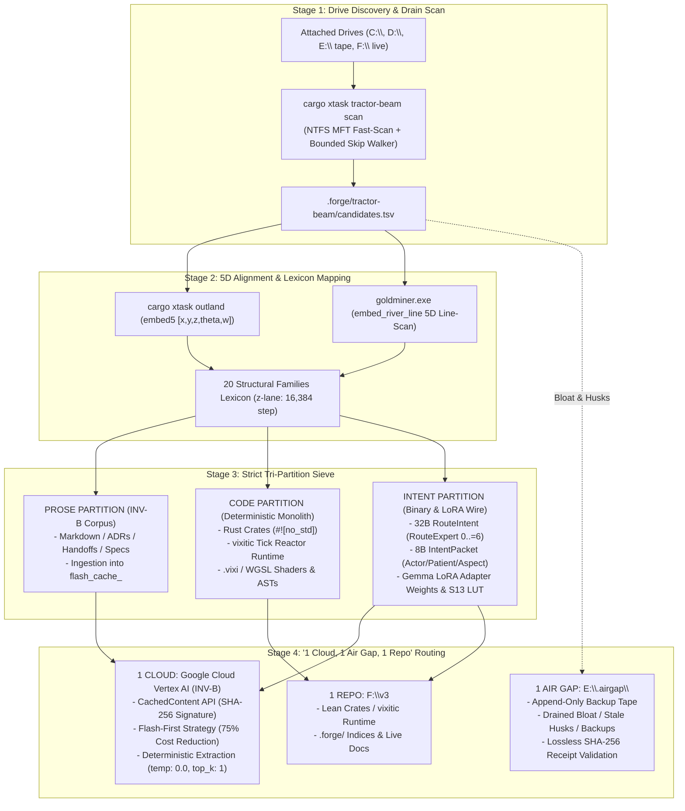

# Implementation Plan: Drive Roundup & Bloat Drain Pipeline (INV-B Vertex AI Context Caching & 1 Cloud, 1 Air Gap, 1 Repo)

## Goal Description

Implement an end-to-end drive roundup, bloat drain, and context caching pipeline based on **INV-B** (*Efficiency method for reuse of prior computational context in repeated data workloads* / Flash Analyzer).

The system harvests all attached drives (`C:\`, `D:\`, `E:\`, `F:\`), frees local disk capacity, and safely siphons all assets into a clean **"1 Cloud, 1 Air Gap, 1 Repo"** distribution with **strict tri-partitioning** (Prose vs Code vs Intent):

1. **1 Cloud (Google Cloud Vertex AI CachedContents — INV-B)**:
   - Structured context cache bundles created with deterministic SHA-256 file signatures (`flash_cache_<sig>`).
   - Prefix context caching with 60-min TTL (`ttl="3600s"`), `temperature: 0.0`, `top_k: 1`, `max_output_tokens: 1024`, and `BLOCK_ONLY_HIGH` safety settings for 75% input token cost reduction.
2. **1 Air Gap (`E:\.airgap\`)**:
   - Append-only tape archive (`e_drive_is_tape`).
   - Drains heavy repository bloat, stale build targets, old `.bak` files, and legacy husks with byte-for-byte SHA-256 verification before freeing local space (lossless, zero-drop G15).
3. **1 Repo (`F:\v3`)**:
   - Lean, high-performance monolith containing only active verified crates, the `vixitic` integer-clock reactor runtime, `.forge/` indices, and live documentation.

---

## The Tri-Partition Architecture (INV-B + Gemma LoRA)



---

## User Review Required

> [!IMPORTANT]
> **INV-B Lossless Drain Protocol (G15 / G10)**
> - **Tape Preservation**: `E:\` is append-only. Files are never overwritten or deleted on `E:\`.
> - **Pre-Drain Verification**: Before any file is purged from `F:\`, `C:\`, or `D:\`, it is copied to `E:\.airgap\bloat_drain\<timestamp>\` and its SHA-256 checksum is asserted against the source.
> - **Zero Nuking**: Active code files, live documentation, and `.forge` manifests remain in `F:\v3`. Only confirmed stale targets (`target/`, `node_modules/`, `.bak`, duplicate unreferenced archives) are drained to `E:\`.

> [!NOTE]
> **INV-B Flash-First Vertex AI Context Caching Configuration**
> - **Model**: `gemini-1.5-flash-001` (or Gemini 2.0 Flash)
> - **TTL**: 60 minutes (`ttl="3600s"`, automatically renewed on active sessions)
> - **Generation Config**: `temperature: 0.0`, `max_output_tokens: 1024`, `top_k: 1`
> - **Safety Settings**: `BLOCK_ONLY_HIGH` across all harm categories to prevent false-positive token burns.

---

## Detailed Specifications: Prose, Code, and Intent

### 1. The Intent Tier (Binary Wire & LoRA Routing)
* **Binary FFI Protocol (`forge-intent-v3`)**:
  - Total Size: `INTENT_BYTES = 32`, `ARGS_LEN = 31`, `PACKET_USED_BYTES = 8`.
  - `RouteExpert` discriminant (1 byte, values `0..=6`):
    - `0`: Sound
    - `1`: Visual
    - `2`: Physics
    - `3`: Sieve
    - `4`: Lorekeeper
    - `5`: World
    - `6`: HumanInterface
  - `IntentPacket` layout:
    - Offset `0` (1B): `RouteExpert` discriminant (`0..=6`)
    - Offset `1..=2` (2B): `actor: u16` (LE)
    - Offset `3..=4` (2B): `patient: u16` (LE)
    - Offset `5` (1B): `aspect: u8`
    - Offset `6` (1B): `handling_class: u8`
    - Offset `7..=8` (2B): `confidence_pmy: u16` (LE, `1..=10_000`)
    - Offset `9..=31` (23B): Strict `0` tail.
* **Gemma LoRA Weights & S13-LUT**:
  - Local edge inference loads fine-tuned LoRA weights to classify user prompt intents into `(RouteExpert, IntentPacket)`.
  - S13 LUT bypasses standard 262k tokenizers into 24-dim autoencoder latent space.
  - Sentinels `243..255` trip out-of-band alerts / zeroization.

### 2. The Code Tier (Deterministic Monolith)
* **`vixitic` Runtime (`F:\output\vixitic`)**:
  - Deterministic tick-reactor async runtime with zero wall-clock dependence.
  - Schedules tasks on integer simulation clocks (`Cond::AtTick(u64)`, `Cond::Event(u64)`).
  - Wakers run in strict registration order with deadlock hang-guards.
* **Rust Crates (`F:\v3\crates\*`)**:
  - `#![no_std]` core primitives (`forge-intent-v3`, `forge-index-v3`, `forge-gpu-warden-v3`, `forge-envelope`).
  - Strict decoupling from narrative text.

### 3. The Prose Tier (INV-B Context Caching)
* **20 Structural Families (`FAMILIES` Lexicon)**:
  - `memory`, `concurrency`, `io`, `network`, `parser`, `scheduler`, `driver`, `test`, `build`, `security`, `ui`, `data`, `error`, `config`, `api`, `graphics`, `audio`, `math`, `cache`, `log`.
* **INV-B Cache Signature Strategy**:
  - Computes deterministic SHA-256 signature over all bundled prose documents.
  - Checks Vertex AI `client.cached_contents.list()` for cache hit before creating a new cache.
  - Formats context payload into structured Markdown blocks for fast data extraction.

---

## Step-by-Step Execution Stages

### Stage 1: Drive Discovery & Drain Scan
- Run `cargo xtask tractor-beam scan --roots C:\,D:\,E:\,F:\` to discover candidate roots.
- Identify bloat candidates (duplicate build artifacts, `.bak`, old logs, orphaned husks).

### Stage 2: 5D Alignment & Tri-Partition Sieve
- Run `cargo xtask outland` and `goldminer.exe` to index and classify candidate files.
- Sieve files into:
  - `prose/`: Documentation, ADRs, transcripts, specifications.
  - `code/`: Source files, `.vixi` shaders, `vixitic` runtime, crate code.
  - `intent/`: 32-byte `RouteIntent` packets, Gemma LoRA configurations, S13 LUT tables.

### Stage 3: Lossless Airgap Drain to `E:\.airgap\`
- Execute `python F:\v3\.forge\tools\drive_drain_sieve.py --drain-to-airgap --target E:\.airgap`.
- Verify SHA-256 checksums of all drained files.
- Record receipts in `F:\v3\.forge\drain_receipts.tsv`.
- Safely clean drained bloat from source drives (`F:\`, `C:\`).

### Stage 4: INV-B Vertex AI Cache Upload
- Execute `python F:\v3\.forge\tools\vertex_cache_assembler.py --upload`.
- Packages Prose and Code partitions into Vertex AI `CachedContent` instances with SHA-256 signatures.
- Emits cache IDs, expiration timestamps, and token savings reports.

---

## Proposed Tools

### [NEW] `F:\v3\.forge\tools\drive_drain_sieve.py`
- Implements the non-destructive drive drain:
  - Scans candidate files from tractor-beam.
  - Categorizes into: `[REPO_ACTIVE | AIRGAP_BLOAT | CLOUD_PROSE | CLOUD_CODE | INTENT]`.
  - Performs verified copy to `E:\.airgap\bloat_drain\<timestamp>\` with SHA-256 reconciliation.

### [NEW] `F:\v3\.forge\tools\vertex_cache_assembler.py`
- Implements the INV-B Flash Analyzer Context Caching pipeline:
  - Uses Google Cloud Vertex AI SDK (`google-genai` / `vertexai.preview.caching`).
  - Deterministic cache naming: `flash_cache_<sha256>`.
  - Handles TTL management, cache reuse, and cost tracking formulas from INV-B.

---

## Verification Plan

### Automated Tests
1. **Intent Binary Protocol Test**:
   ```pwsh
   cargo test -p forge-intent-v3
   ```
2. **Vixitic Deterministic Reactor Test**:
   ```pwsh
   cargo test --manifest-path F:\output\vixitic\Cargo.toml
   ```
3. **Outland 5D Index Test**:
   ```pwsh
   cargo test -p forge-index-v3
   ```
4. **INV-B Cache Assembler Dry-Run**:
   ```pwsh
   python F:\v3\.forge\tools\vertex_cache_assembler.py --dry-run
   ```
   *Asserts SHA-256 signature generation, token calculation, and configuration constants (`temp: 0.0, top_k: 1, max_output_tokens: 1024`).*

5. **Lossless Drain Check**:
   ```pwsh
   python F:\v3\.forge\tools\drive_drain_sieve.py --dry-run
   ```
   *Validates zero data loss, exact byte matching, and safe airgap destination paths.*
